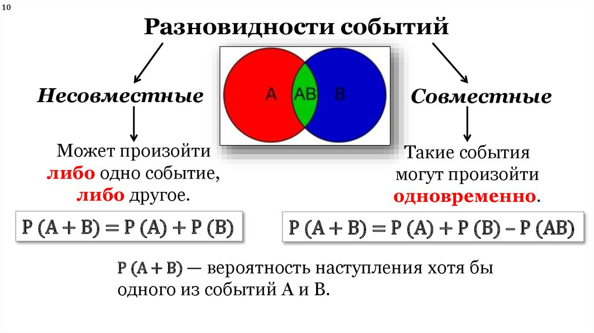
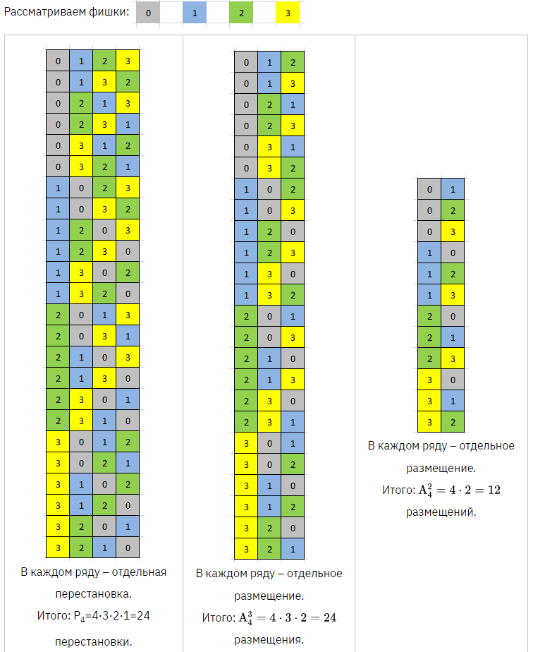
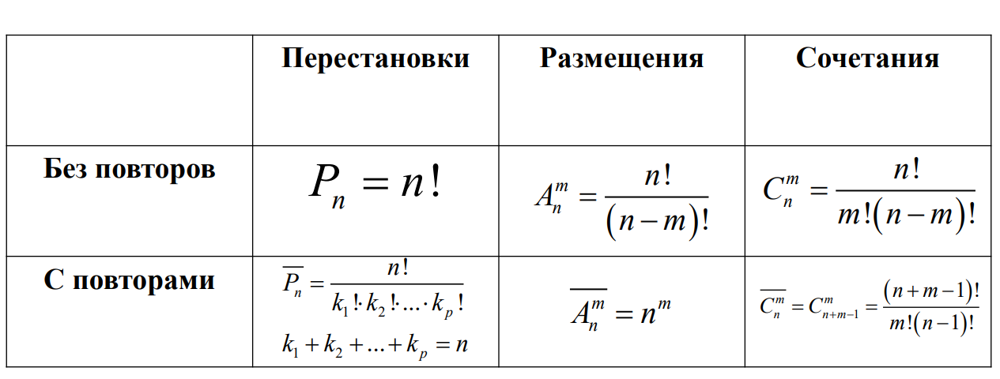
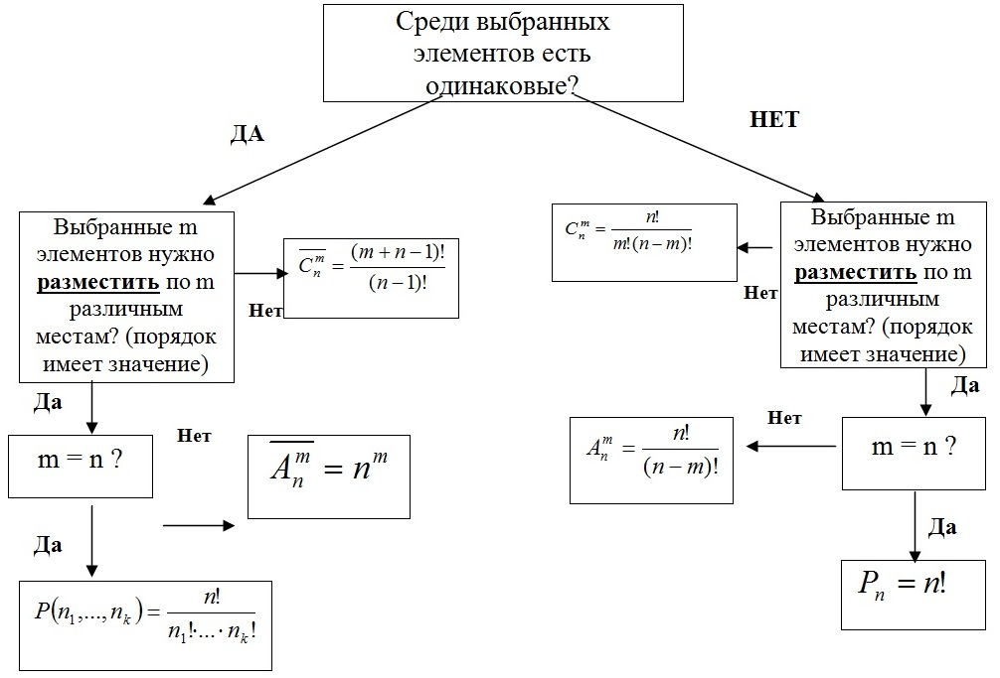

## Простые правила и аксиомы комбинаторики

Комбинаторика - раздел математики, в котором изучаются подмножества, различные конфигурации и комбинации, составимые из элементов данного подмножества, предпочтительные тем или иным условиям.

Применяется в теории игр, теории принятия решений, теории вероятностей, машинном обучении, алгоритмах и т.д.

Основные направления комбинаторики:

1.  изучение известных конфигураций

2.  исследование неизвестных конфигураций

3.  подсчёт их числа

4.  приблизительный подсчёт числа конфигураций

5.  перечисление конфигураций

## Правила и аксиомы комбинаторики.

### Правило суммы

1.  Правило суммы. Если элемент $a$ может быть выбран $m$ способами, a элемент $b$ другими $k$ способами, то выбор одного из этих элементов $a$ или $b$ может быть сделан $(m + k)$ способами.

**Общее определение**. Пусть объект $a_1$ можно выбрать $n_1$ способами, объект $a_2$ можно выбрать $n_2$ способами, . . . , объект $a_k$ можно выбрать $n_k$ способами, причём выбор одного объекта исключает одновременный выбор другого объекта. Тогда выбор «либо $a_1$, либо $a_2$, . . . , либо $a_k$» можно осуществить $n_1$ + $n_2$ + . . . + $n_k$ способами.

**Пример 1**. В мешке имеется 12 зелёных шаров, 7 красно-зелёных шаров, 5 синих шаров, 8 красных шаров и 6 сине-зелёных шаров. Сколькими способами можно выбрать шар с зелёным цветом?

**Пример 2**. Пусть есть колода карт (36 листов). Объект $Х$ -- карта червовой масти -- может быть выбран 9-ю разными способами. Объект $Y$ -- туз -- может быть выбран 4-мя разными способами. Сколькими способами может быть выбран объект «$Х$ или $Y$» -- «червовая карта или туз»?

В примере №2 правило суммы не работает ввиду нахождения в задаче *совместных событий*. События называются совместными, когда они оба могут происходить в один и тот же момент наблюдения и могут наблюдаться в качестве свойств одного объекта или явления.

В терминах теории множеств, **выбираемые множества**, для использования правила суммы, **пересекаться не должны**

**Определение**: Случайные события А и В называются независимыми, если появление одного из них не влияет на вероятность появления другого события, в противном случае события называются зависимыми.

Замечание: В этом определении речь идет не о причинно-следственной связи между событиями, а о вероятностной (появление одного из них не влияет на вероятность появления другого события), которая является более общей зависимостью между событиями.

### Правило произведения

2.  Правило произведения. Если элемент $a$ может быть выбран $n$ способами, а затем элемент $b$ выбирается $m$ способами, то выбор пары элементов $(a, b)$ в указанном порядке может быть произведён $m\cdot n$ способами.

**Общее определение**. Пусть объект $a_1$ можно выбрать $n_1$ способами, после чего объект $a_2$ можно выбрать $n_2$ способами, . . . , после чего объект $a_k$ можно выбрать $n_k$ способами. Тогда цепочку $(a_1, a_2, . . . , a_k)$ можно выбрать $n_1\cdot n_2 \cdot . . . \cdot n_k$ способами; иными словами, существует $n_1\cdot n_2 \cdot . . . \cdot n_k$ цепочек $(a_1, a_2, . . . , a_k)$.

**Пример 2.** В школьном классе учится 12 мальчиков и 14 девочек. Сколькими способами можно составить пару ведущих группы "мальчик-девочка"? Сколькими способами можно затем составить вторую пару идущих за ними?

**Пример 3.** В мешке хранится 8 черных кубиков, 6 красных кубиков и 4 синих кубика с различными буквами на их гранях. Сколькими способами может быть составлена комбинация разноцветных троек таких кубиков?

### Правило включения и исключения

3.  Правило включения-исключения. Если $M$ элементов обладают свойством $S$ и $k$ элементов обладают свойством $Р$, то свойством $S$ или $Р$ обладает $m + k - l$ элементов, где $l$ - количество элементов, которые имеют свойство $S$ и свойство $Р$.

**Пример 2**. Пусть есть колода карт (36 листов). Объект $Х$ -- карта червовой масти -- может быть выбран 9-ю разными способами. Объект $Y$ -- туз -- может быть выбран 4-мя разными способами. Сколькими способами может быть выбран объект «$Х$ или $Y$» -- «червовая карта или туз»?

# Классическая задача комбинаторики

Классическая задача комбинаторики - определить число способов размещения некоторых объектов в каком-либо объёме так, чтобы были выполнены заданные ограничения. Объемами в таком смысле являются мощности соответствующих множеств объектов:

## Размещения, перестановки и сочетания

### Сочетания без повторений

Сочетаниями называются упорядоченные наборы из m элементов выбранных из n элементов, которые отличаются друг от друга составом элементов.

Классической задачей комбинаторики является задача о числе сочетаний без повторений, содержание которой можно выразить вопросом: сколькими способами можно выбрать $m$ из $n$ различных предметов?

То есть в данной постановке речь идет о поиске максимально большого возможного числа уникальных наборов объектов с уникалным набором конфигураций (свойств).

$$
C_n^m = \begin{pmatrix} n \\ m \end{pmatrix} = \frac{n!}{m!(n - m)!}
$$

**Пример №3.** На плоскости расположены $N$ точек, из которых никакие три не лежат на одной прямой. Сколько различных прямых можно провести через эти точки.

**Правило симметрии.** $C_n^m = C_{n}^{n - m}$

**Правило Паскаля.** $C_n^m = C_{n-1}^{m} + С_{n - 1}^{m - 1}$

### Сочетания с повторениями

Имеется по $r$ одинаковых предметов каждого из $n$ различных типов; сколькими способами можно выбрать $m$ $(m \le r)$ из этих $(n\cdot r)$ предметов?

$$
  \overline{C}_n^m = C_{n+m-1}^{m} = \frac{(n+m-1)!}{m!(n-1)!}
$$

**Сочетанием с повторениями** называются наборы, в которых каждый элемент может участвовать несколько раз.

**Пример №4.** Имеются предметы $n$ различных видов. Число элементов каждого вида неограниченно. Сколько существует расстановок длины $m$, если не принимать во внимание порядок элементов?

### Размещения без повторений

Классической задачей комбинаторики является задача о числе размещений без повторений, содержание которой можно выразить вопросом: сколькими способами можно выбрать и разместить по $m$ различным местам $m$ из $n$ различных предметов?

Поиск числа различных комбинаций, составленных из $m$ предметов $n$-элементного набора данных ($m < n$).

**Размещениe без повторений** – это упорядоченная $⟨n, m⟩$ – выборка без повторениn. Общее количество размещений без повторений:

$$
  A_n^m = \frac{n!}{(n - m)!}
$$

**Пример №5.** Дано множество $A = \{a, b, c\}$. Тогда итоговым размещением без повторений $A_3^2$ будет являться следующее множество:
$$
A^* = \{(a, b), (a , c), (b , c), (b, a), (c, a), (c, b)\}
$$

### Размещения с повторениями

**Размещение с повторением** – это упорядоченная $(n, m)$ – выборка с повторениями. Общее количество размещений с повторениями:

$$
\overline{A_n^m} = n^m
$$
**Пример №6.** Для создания 3-значного пароля используются символы из алфавита $\{+,*,A,!,2\}$. Сколько всего паролей можно составить?

**Пример №7.** Фишки:

### Перестановки без повторений

$$
  P_n = n!
$$

**Лексикографический порядок** – способ упорядочения перестановок, основанный на сравнении. 
Меньшей считается та перестановка, у которой на первом месте стоит меньший элемент. Если оба первых элементов равны, сравниваются вторые элементы; и т.д. Отношение лексикографического «меньше» обозначается $≺$. Читается «меньше» или «предшествует».

**Пример №8.** Для $A=\{a,b,c\}$, $n=3$. Все перестановки без повторений: $(a,b,c),(b,c,a),(c,a,b),(b,a,c),(a,c,b),(c,b,a)$. 
В лексикографическом порядке: $(a,b,c)≺(a,c,b)≺(b,a,c)≺(b,c,a)≺(c,a,b)≺(c,b,a)$ .

### Перестановки с повторениями

**Перестановка с повторениями** – это упорядоченная $⟨n,k⟩$ – выборка с повторениями, в которой элемент $a_1$ повторяется $k_1$ раз, элемент  $a_2$ повторяется  $k_2$ раз, и так далее, до последнего элемента $a_s$, который повторяется $k_s$ раз $(s ≤ n)$. При этом $n = k_1 + k_2 + \dots + k_s$.

Общее количество перестановок с повторениями:

$$
P_n (k_1, k_2, \dots, k_s) = \frac{k!}{k_1!k_2!\dots k_s!}
$$

**Пример №9.** Сколько различных 6-тибуквенных слов можно написать из 3 букв {a,b,c}, если буква a должна повторяться 3 раза, буква b – 2 раза, буква c – 1 раз.

### Основные формулы комбинаторики

### Хинт

## Числа Стирлинга

### Числа Стирлинга первого рода со знаком

$(x)_n, [x]_n$ - символ Погхаммера (убывающий факториал)

$$
  [x]_n = x(x - 1)(x - 2) \dots (x - n + 1)
$$

**Числами Стирлинга первого рода** (со знаком) $s(n, k)$ называются коэффициенты многочлена:

$$
[x]_n = \sum_{k = 0}^{n} s(n, k) x^k
$$

### Числа Стирлинга первого рода без знака

Как видно из определения, числа имеют чередующийся знак. Их абсолютные значения, называемые числами Стирлинга первого рода без знака, задают количество перестановок множества, состоящего из $n$ элементов с $k$ циклами, и обозначаются

$$
  c(n, k)  = \begin{bmatrix} n\\k \end{bmatrix} = |s(n, k)| = (-1)^{n - k}s(n, k)
$$
Производящая функция чисел стирлинга первого рода без знака:

$$
[x]^n = \sum_{k = 0}^{n} с(n, k) x^k = x(x + 1) (x + 2) \dots (x + n -1)
$$

### Рекуррентное соотношение для числа Стирлинга первого рода

Числа Стирлинга первого рода задаются рекуррентным соотношением:

- $s(0, 0) = c(0, 0) = 1$,

- $s(n, 0) = c(n, 0) = 0$, для $n > 0$,

- $s(0, k) = c(0, k) = 0$, для $k > 0$,

- для чисел со знаком: $s(n ,k) = s(n - 1, k - 1) - (n - 1) \cdot s(n - 1, k)$ для $0 < k < n$.

- для чисел без знака: $c(n ,k) = c(n - 1, k - 1) - (n - 1) \cdot c(n - 1, k)$ для $0 < k < n$.

### Число Стирлинга второго рода

В комбинаторике числом Стирлинга второго рода из $n$ по $k$, обозначаемым $S(n,k)$ или $\begin{Bmatrix} n \\ k \end{Bmatrix}$, называется количество неупорядоченных разбиений $n$-элементного множества на $k$ непустых подмножеств.

$$
  S(n, k) = \frac{1}{k!} \sum_{j = 0}^{k} (-1)^{k + j} C_k^j \cdot j^n
$$
**Числа Стирлинга удовлетворяют рекуррентным соотношениям**:

1. $S(n, k) = S(n - 1, k - 1) + k \cdot S(n - 1, k); \ 0 < k \le n$

2. $S(n, k) = \sum_{j = 0}^{n - 1} C_{n-1}^{j} S(j, k-1)$

при естественных начальных условиях $S(0, 0) = 1$, $S(n, 0) = 0$ при $n > 0$ и $S(j, k) = 0$ при $k > j$

## Задачи

### Задача №1

Стандартная колода карт из 52 карт имеет 13 рангов $R = \{A, 2, 3, 4, 5, 6, 7, 8, 9, T, J, Q, K\}$ и 4 масти $S = \{черви, буби, крести, пики\}$.

Вопрос №1. Рассмотрим комбинации из 5 карт, взятых из колоды. Сколько раздач из 5 карт, взятых из колоды, являются флешами? Сколько раздач из 5 карт, взятых из колоды, являются стритами? Сколько пятикарточных раздач, взятых из колоды являются фулл-хаусами?

Вопрос №2. Предположим, вам раздали комбинацию из 5 карт из колоды. Сколько из этих комбинаций включают в себя ровно одного короля и ровно одну карту масти пик? Сколько из этих комбинаций включают в себя хотя бы одного короля и хотя бы одну карту масти пик?

### Задача №2

Множество $X \subset \mathbf{R}^n$ таково, что расстояние между любыми двумя точками из $X$ равно $a$ или $b$. Докажите, что

$$
  |X| \le \frac{(n+1)\cdot (n+4)}{2}.
$$

### Задача №3

В детском саду "Орлёнок" обучается $n$ детей и действует $n$ группировок. Воспитатель хочет выбрать в каждой группировке по два главаря и поставить детей в хоровод так, чтобы главари одной группировки стояли рядом. Докажите, что если каждая группировка состоит хотя бы из $n/2 + 1$ ребёнка, а каждый ребёнок состоит хотя бы в $n/2 + 1$ группировке, то у воспитателя это получится.

### Задача №4

Сколько подмножеств у 5-элементного множества? У $n$-элементного?

### Задача №5

Сколькими способами можно разложить m различных шаров в n различных ящиков? На число шаров в ящике ограничений нет

### Задача №6

Сколько делителей у числа 720?

### Задача №7

Пусть $p_1, p_2, . . . , p_n$ --- различные простые числа; $k_1, k_2, . . . , k_n$ --- целые неотрицательные числа. Сколько делителей у числа $a = p_1^{k_1} \cdot p_2^{k_2} \cdot \dots \cdot p_n^{k_n}$?

### Задача №8

Для создания 3-значного пароля используются символы из алфавита {+,*,A,!,2}.
Сколько всего паролей без повторения символов можно составить?

### Задача №9

Составьте таблицу 6 на 6 для первых чисел Стирлинга 1-го рода со знаком на основе рекуррентных соотношений.

### Задание №10

Дать определение числу Белла, его свойств и предоставить пример его использования

