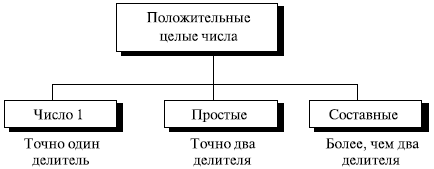
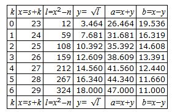
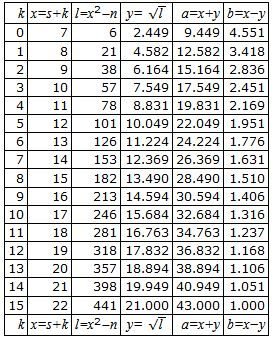

# **Простые числа**

## **Определение**

Положительные целые числа могут быть разделены на три группы: число 1, простые числа и составные объекты.

Положительное целое число --- **простое число** тогда и только тогда, когда оно точно *делимо* без остатка на два целых числа --- на 1 и на само себя.

**Составной объект** --- положительное целое число больше с чем двумя делителями.

## **Взаимно простые числа**

Два положительных целых числа $a$ и $b$ являются взаимно простыми (coprime), если $НОД (a, b) = 1$, потому что число $1$ является взаимно простым с любым целым числом. Если $p$ --- простое число, тогда все числа от $1$ до $p–1$ являются взаимно простыми к $p$. Множество $Z_n^*$, чьи элементы --- все числа, взаимно простые с $n$. Множество $Z_p^*$ является тем же самым, за исключением того, что модуль $p$ --- простое число.

## **Количество простых чисел**

**Число простых чисел бесконечно**. Приведем нестрогое доказательство: предположим, что множество простых чисел конечно (ограничено), и пусть $p$ --- наибольшее простое число. Перемножим все простые числа, входящие в это множество, и получим результат $P = 2 \cdot 3 \cdot \cdots \cdot p$. Целое число $P + 1$ не может иметь простого делителя $q \leqslant p$ ($p$ -- наибольшее простое число). Тогда этот делитель должен быть одним из множителей, входящих в $P$. Это значит, что $q$ делит $P$. Если $q$ также делит $P + 1$, то $q$ делит $P + 1 – P = 1$. Единственное число, которое делит $1$, --- это сама $1$, которая не является простым числом. Поэтому $q$ должно быть большим, чем $p$, и ряд простых чисел не исчерпывается принятым конечным множеством.

**Число простых чисел бесконечно**.

## **Пример**

Как тривиальный пример, предположим, что единственные простые числа находятся в множестве ${2, 3, 5, 7, 11, 13, 17}$. Здесь $P = 510510$ и $P + 1 = 510511$. Однако $510511$ состоит из следующих простых чисел $510511 = 19 \cdot 97 \cdot 277$; ни одно из этих простых чисел не было в первоначальном списке. Эти три простых числа больше, чем $17$.

# **Число простых чисел, меньше заданного**

## **Функция числа простых чисел, ниже n**

Введем функцию $\pi (n)$, которая определяет число простых чисел, меньших или равных n. Ниже показаны значения этой функции для различного $\pi (n)$.

$$
\pi (1) = 0 \ \ \   \pi (2) = 1 \ \ \   \pi (3) = 2 \ \ \   \pi (10) = 4 \ \ \   \pi (20) = 8 \ \ \  \pi (50) = 15 \ \ \   \pi (100) = 25
$$

Но если $n$ является очень большим, как мы можем вычислить $\pi (n)$? Для ответа мы можем использовать только приближение, которое показано ниже:

$$
\left[ {n/(\ln n)} \right] < \pi (n) < [n/(\ln n-1.08366)]
$$

Гаусс обнаружил верхний предел; Лагранж обнаружил нижний предел.

## **Пример**

**Найдите количество простых чисел, меньших, чем** $1 000 000$.

Приближение дает диапазон от $72 383$ до $78 543$. Фактическое число простых чисел --- $78 498$.

# **Проверка на простое число**

## **Тривиальное решение**

Как мы можем определить для данного числа $n$, является ли оно простым числом? Мы должны проверить, *делимо* ли без остатка это число всеми простыми числами, меньшими, чем $\sqrt n$ . Мы знаем, что этот метод неэффективен, но он хорош для начала.

## **Пример**

**Действительно ли** $97$ --- простое число?

Наибольшее ближайшее целое число --- $\sqrt n = 9$. Простые числа меньше чем $9$ --- $2, 3, 5$ и $7$. Проверим, делимо ли без остатка $97$ любым из этих номеров. Ответ: не делимо, так что $97$ --- простое число.

**Действительно ли** $301$ --- простое число?

Наибольшее ближайшее целое число $\sqrt 301 = 17$. Мы должны проверить $2, 3, 5, 7, 11, 13$ и $17$. Числа $2, 3$ и $5$ не делят $301$, но $7$ --- делит. Поэтому $301$ --- не простое число.

## **Решето Эратосфена**

Греческий математик Эратосфен изобрел метод, как найти все простые числа, меньшие, чем $n$.

Метод назван решетом Эратосфена. Предположим, что мы хотим найти все числа, меньшие, чем $100$. Мы записываем все числа между $2$ и $100$. Поскольку $\sqrt 100 = 10$, мы должны видеть, делим ли без остатка любой номер меньше чем $100$ на числа $2, 3, 5$ и $7$.

|     |  **2**  |  **3**  | 4   |  **5**  | 6   |  **7**  | 8   | 9   | 10  |
|:---:|:---:|:---:|-----|:---:|-----|:---:|-----|-----|-----|
| **11**  | 12  | **13**  | 14  | 15  | 16  | **17**  | 18  | **19**  | 20  |
| 21  | 22  | **23**  | 24  | 25  | 26  | 27  | 28  | **29**  | 30  |
| **31**  | 32  | 33  | 34  | 35  | 36  | **37**  | 38  | 39  | 40  |
| **41**  | 42  | **43**  | 44  | 45  | 46  | **47**  | 48  | 49  | 50  |
| 51  | 52  | **53**  | 54  | 55  | 56  | 57  | 58  | **59**  | 60  |
| **61**  | 62  | 63  | 64  | 65  | 66  | **67**  | 68  | 69  | 70  |
| **71**  | 72  | **73**  | 74  | 75  | 76  | 77  | 78  | **79**  | 80  |
| 81  | 82  | **83**  | 84  | 85  | 86  | 87  | 88  | **89**  | 90  |
| 91  | 92  | 93  | 94  | 95  | 96  | **97**  | 98  | 99  | 100 |

: Решето Эратофсена

**Процесс состоит в следующем:**

1. Вычеркнуть все числа, делимые без остатка на 2 (кроме самого 2).

2. Вычеркнуть все числа, делимые без остатка на 3 (кроме самого 3).

3. Вычеркнуть все числа, делимые без остатка на 5 (кроме самого 5).

4. Вычеркнуть все числа, делимые без остатка на 7 (кроме самого 7).

5. Оставшиеся числа – простые.

# **Функция $\varphi$ Эйлера**

## **Определение**
**$\varphi$-функция Эйлера**, $\varphi (n)$, которую иногда называют **тотиентой Эйлера**, играет очень важную роль в криптографии. Функция $$\varphi (n)$$ находит из ряда чисел $0,1, \dots, n–1$ числа, взаимно простые с $n$. 

1. $\varphi (1)=0.$
2. $\varphi (p)=p-1$, если $p$ — простое число.
3. $\varphi (m \cdot n) = \varphi (m) \cdot \varphi (n)$, если $m$ и $n$ — взаимно простые.
4. $\varphi ({p^e}) = {p^e} - {p^{e - 1}}$, если $p$ — простое.

Мы можем объединить эти четыре правила, предназначенные для нахождения $\varphi (n)$.

$$
\varphi (n) = ({p_1}^{{e_1}} - {p_1}^{{e_1} - 1}) \cdot ({p_2}^{{e_2}} - {p_2}^{{e_2} - 1}) \cdot \dots \cdot ({p^{{e_k}}} - {p^{{e_k} - 1}})
$$

Очень важно заметить, что значение $\varphi (n)$ для больших чисел может быть найдено, если может быть найдено число $n$ и если $n$ может быть представлено в виде разложения простых чисел. Другими словами, трудность нахождения $\varphi (n)$ зависит от трудности нахождения разложения $n$.

**Трудность нахождения $\varphi(n)$ зависит от трудности нахождения разложения $n$.**

### **Пример**

**Какое значение имеет $\varphi (13)$?**

Поскольку 13 — простое число, $\varphi (13)=(13-1)=12$.

### **Пример**

**Какое значение имеет $\varphi (10)$?**

Мы можем использовать третье правило: $\varphi (10) = \varphi (2) \cdot \varphi (5) = 1 \cdot 4 = 4$, поскольку $2$ и $5$ — простые числа.

### **Пример**

**Какое значение имеет $\varphi (240)$?**

Мы можем записать $240 = {2^4} \cdot {3^1} \cdot {5^1}$.

Тогда

$$\varphi (240) = ({2^4} - {2^3}) \cdot ({3^1} - {3^0}) \cdot ({5^1} - {5^0}) = 64$$

### **Пример**

**Можно ли утверждать, что $\varphi (49) = \varphi (7) \cdot \varphi (7) = 6 \cdot 6 = 36$ ?**

Нет.

$$\varphi (49) = {7^2} - {7^1} = 42.$$

### **Пример**

**Какие числа являются элементами в $Z_{14}^{*}$?**

$\varphi (14) = \varphi (7) \cdot \varphi (2) = 6 \cdot 1 = 6$. Элементы – это $1, 3, 5, 9, 11$ и $13$.

**Интересный факт: если $n > 2$, значение $\varphi(n)$ — четное**.

# **Малая теорема Ферма**

## **Первая версия**

Первая версия говорит, что если $p$ — простое число и $a$ — целое число, такое, что $p$ не является делителем $a$, тогда ${a^{p - 1}} \equiv 1\  \{p\}$.

## **Вторая версия**
Вторая версия вводит ограничивающие условие на $a$. Она утверждает, что если $p$ — простое число и $a$ — целое число, то ${a^p} \equiv a \ \{p\}$.

## **Приложения**

### **Возведение в степень**

Малая теорема Ферма иногда полезна для того, чтобы быстро найти решение при возведении в степень.

### **Пример**

**Найдите результат $6^{10}\{11\}$**

Мы имеем ${6^{10}} \ \{11\} \equiv 1$. Это первая версия малой теоремы Ферма, где $p = 11$.

### **Пример**

**Найдите результат 3^12\ \{11\}**

Здесь степень $12$ и модуль $11$ не соответствуют условиям теоремы Ферма. Но, применяя преобразования, мы можем привести решение к использованию малой теоремы Ферма.

$${3^{12}}\ \{11\} \equiv ({3^{11}} \cdot 3)\ \{11\} \equiv ({3^{11}}\ \{11\})\ (3 \ \{11\}) \equiv (3 \cdot 3) \ \{11\} = 9$$

### **Мультипликативные инверсии**

Очень интересное приложение теорема Ферма находит для некоторых мультипликативных инверсий, если модуль — простое число. Если $p$ — простое число и $a$ — целое число, такое, что $p$ не является его делителем, тогда $a^{-1} \ \{p\} = a^{p-2} \ \{p\}$. Это может быть легко доказано, если мы умножим обе стороны равенства на $a$ и используем первую версию малой теоремы Ферма:

$$a \cdot  a^{-1} \ \{p\} \equiv  a \cdot  a^{p-2} \ \{p\} \equiv  a^{p-1} \ \{p\} \equiv  1 \ \{p\}$$	

Это приложение позволяет не использовать расширенный алгоритм Евклида для нахождения мультипликативных инверсий.

### **Пример**

Инверсии по модулю простого числа могут быть найдены без использования расширенного Евклидова алгоритма:

1. $8^{-1} \ \{17\} = 8^{17-2} \ \{17\} = 8^{15} \ \{17\} = 15\ \{17\}$

2. $5^{–1} \ \{23\} = 5^{23-2} \ \{23\} = 5^21 \ \{23\} = 14 \ \{23\}$

3. $60^{101} \ \{101\} = 60^{101-2} \ \{101\} = 60^{99} \ \{101\} = 32 \ \{101\}$

4. $22^{-1} \ \{211\} = 22^{211-2} \ \{211\} = 22^{209} \ \{211\} = 48 \ \{211\}$

# **Теорема Эйлера**

Теорему Эйлера можно представить как обобщения малой теоремы Ферма. Модуль в теореме Ферма — простое число, модуль в теореме Эйлера — целое число. 

## **Первая версия**

Первая версия теоремы Эйлера подобна первой версии малой теоремы Ферма. 

**Теорема**. Если $a$ и $n$ – взаимно простые, то ${a^{\varphi (n)}} \equiv 1\ \{n\}$.

## **Вторая версия**

Вторая версия теоремы Эйлера подобна второй версии малой теоремы Ферма; она устраняет условие, что $n$ должно быть взаимно простым с $a$. 

**Теорема**. Если $n = p \cdot q,a < n$, а $k$ — целое число, то ${a^{k \cdot \varphi (n) + 1}} \equiv a \ \{n\}$.

Приведем нестрогое доказательство второй версии, основанной на первой версии. Поскольку $a < n$, то возможны три случая:

1. Если $a$ не кратно ни числу $p$, ни числу $q$, то $a$ и $n$ – взаимно простые.

$$
a^{k\cdot \varphi (n)+1} \ \{n\} = (a^{\varphi (n)})^{k} \cdot a \ \{n\}= (1)^{k} \cdot  a \ \{n\} = a \ \{n\}	
$$

2. Если $a$ — кратное число $p$, $a = (i \cdot p)$, но не кратно числу $q$.

$$a^{\varphi (n)} \ \{q\} = (a^{\varphi (q)} \ \{q\})^{\varphi (p)} \ \{q\} = 1 \to  a^{\varphi (n)} \ \{q\} = 1$$

$$a^{k\cdot \varphi (n)} \ \{q\} = (a^{\varphi (n)} \ \{q\})^{k} \ \{q\} = 1 \to  a^{k\cdot \varphi (n)} \ \{q\} = 1$$

$$a^{k\cdot \varphi (n)} \ \{q\} = 1 \to  a^{k\cdot \varphi (n)} = 1+j \cdot q \ \text{ (интерпретация сравнения)}$$ 

$$a^{k\cdot \varphi (n)+1} = a \cdot  (1+j \cdot  q) = a+j\cdot q\cdot a=a+(i\cdot j)\cdot q\cdot p = a+(i\cdot j)\cdot n$$

$$a^{k\cdot \varphi (n)+1} = a+(i\cdot j)\cdot n \to  a^{k\cdot \varphi (n)+1} = a \ \{n\} \ \text{ (отношение конгруэнтности)}$$

3. Если $a$ кратно $q$ $(a = i \cdot q)$, но не кратно $p$, доказательство второго случая то же самое, но $p$ и $q$ меняются местами.

Вторая версия теоремы Эйлера используется в криптографической системе RSА.

## **Возведение в степень** 

Теорема Эйлера иногда полезна, чтобы быстро найти решение некоторых задач с возведением в степень. 

### **Пример**

**Найдите результат $6^{24} \ \{35\}$.**

Мы имеем ${6^{24}} \ \{35\} = {6^{\varphi (35)}}\ \{35\} = 1$

### **Пример**

**Найдите результат 20^{62} \ \{77\}**.

Если введем $k = 1$ согласно второй версии, мы имеем:

$$20^{62} \ \{77\} = (20 \ \{77\}) \ \{77\} = (20)(20) \ \{77\} = 15$$

## **Мультипликативные инверсии**

Формула Эйлера может использоваться, чтобы найти мультипликативную инверсию по простому модулю. Теорема Эйлера может применяться, чтобы найти мультипликативные инверсии по составному модулю. Если $n$ и $a$ – взаимно простые, то ${a^{ - 1}} \ \{n\} = {a^{\varphi (n) - 1}} \ \{n\}$. Это может быть легко доказано умножением обеих сторон равенства на $a$.

$$a^{-1} \ \{n\} = a \cdot  a^{\varphi (n)-1} \ \{n\} = a^{\varphi (n)} \ \{n\} = 1 \ \{n\}$$

### **Пример**

Мультипликативная инверсия по составному модулю может быть найдена без использования расширенного евклидова алгоритма, если мы знаем разложение на множители составного объекта:

a. ${8^{ - 1}}\ \{77\} = {8^{\varphi (77) - 1}}\ \{77\} = {8^{59}}\ \{77\} = 29\ \{77\}$

b. ${7^{ - 1}}\ \{15\} = {7^{\varphi (15) - 1}}\ \{15\} = {7^{7}}\ \{15\} = 13\ \{15\}$

c. ${6^{ - 1}}\ \{187\} = {7^{\varphi (187) - 1}}\ \{187\} = {60^{159}}\ \{187\} = 53\ \{187\}$

d. ${71^{ - 1}}\ \{187\} = {71^{\varphi (100) - 1}}\ \{187\} = {71^{39}}\ \{187\} = 31\ \{187\}$

## **Генерация простых чисел**

Два математика, Мерсенна и Ферма, попытались получить формулу, которая могла бы генерировать простые числа.

### **Простые числа Мерсенны**

Мерсенна предложил следующую формулу, которую называют номера Мерсенны. Он предполагал, что формула перечисляет все простые числа.

$$M_p = 2^p–1$$

Если $p$ в приведенной выше формуле — простое число, то, как предполагали, $M_p$ должно быть простым числом. Годы спустя было доказано, что не все числа, полученные по формуле Мерсенны, — простые числа. Ниже приведен список некоторых номеров Мерсенны.

$M_{2} = 2^{2} – 1 = 3$

$M_{3} = 2^{3} – 1 = 7$

$M_{5} = 2^{5} – 1 = 31$

$M_{7} = 2^{7} – 1 = 127$

$M_{11} = 2^{11} – 1 = 2047$     Непростое число ($2047 = 23 \cdot  89$)

$M_{13} = 2^{13} – 1 = 8191$

$M_{17} = 2^{17} – 1 = 131071$

Оказалось, что $M_{11}$ — не простое число. Однако было найдено, что $M_{41}$ число по формуле Мерсенны — простые; одно из последних найденных чисел Мерсенны — $М_{124036583}$, наибольшее число содержит $7 253 733$ цифр. Поиск продолжается.

### **Простые числа Ферма**

Ферма попытался найти формулу для генерации простых чисел. Он предложил следующую формулу, которая теперь называется формулой Ферма, и проверил номера от $F_0 \ (n=0,1,…) \ \text{ до } \ F_4$, но оказалось, что уже $F_4$ — не простое число.

${F_n} = {2^{{2^n}}} + 1$

$F_0 = 3$

$F_1 = 17$

$F_2 = 257$

$F_3 = 65537$

$F_{4} = 4294967297 =  641 \cdot  6700417$. Не простое число

Фактически было доказано, что многие номера до $F_{24}$ — составные числа.

# **Испытание простоты чисел** 

## **Предисловие**

Если формулы получения простых чисел, подобно формулам Ферма или Мерсенна, не гарантируют, что полученные числа — простые, то как мы можем генерировать большие простые числа для криптографии? Мы можем только выбрать случайно большое число и провести испытание, чтобы убедиться, что оно — простое.

Нахождение алгоритма, который правильно и эффективно проверяет очень большое целое число и устанавливает: данное число – простое это число или же составной объект, — всегда было проблемой в теории чисел и, следовательно, в криптографии. 

Алгоритмы, которые решают эту проблему, могут быть разделены на две обширные категории — детерминированные алгоритмы и вероятностные алгоритмы. Ниже рассматриваются некоторые представители обеих категорий. Детерминированный алгоритм всегда дает правильный ответ. Вероятностный алгоритм дает правильный ответ в большинстве, но не во всех случаях. Хотя детерминированный алгоритм идеален, он обычно менее эффективен, чем соответствующий вероятностный.

## **Детерминированные алгоритмы**

Детерминированный алгоритм, проверяющий простоту чисел, принимает целое число и выдает на выходе признак: это число — простое число или составной объект. До недавнего времени все детерминированные алгоритмы были неэффективны для нахождения больших простых чисел. Как мы коротко покажем, новые взгляды делают эти алгоритмы более перспективными.

### **Алгоритм теории делимости**

Самое элементарное детерминированное испытание на простоту чисел — испытание на делимость. Мы используем в качестве делителей все числа, меньшие, чем $\sqrt n$. Если любое из этих чисел делит $n$, тогда $n$ — составное.

-----------------

**Алгоритм**

Точка входа -- натуральное число $n$.

1. $r = 2$.

2. Пока $r < \sqrt n$ проверяем не равно ли побитовое **ИЛИ** чисел $r$ и $n$ нулю.

3. Если побитовое **ИЛИ** чисел $r$ и $n$ равно нулю, тогда прибавляем к $r$ единицу $r := r + 1$ и переходим на шаг 2, иначе выходим из алгоритма с ответом "СОСТАВНОЕ".

4. Если $r >= \sqrt n$, то выходим из алгоритма с ответом "ПРОСТОЕ".

-----------------

Алгоритм может быть улучшен, если проверять только нечетные номера. Он может быть улучшен далее, если использовать таблицу простых чисел между $2$ и $\sqrt n$. Число арифметических операций в алгоритме — $\sqrt n$. Если мы принимаем, что каждая арифметическая операция использует только операцию на один бит (чисто условное соглашение), тогда сложность разрядной операции алгоритма — $\sqrt {{2^{{n_b}}}}  = 2 ^ {{n_b} / 2}$, где $n_b$ – число битов в $n$. В больших системах, обозначаемых $О$, сложность может быть оценена $O(2^n)$: экспоненциально. Другими словами, алгоритм делимости неэффективен, если $n_b$ большое.

**Сложность побитного испытания делимостью показательна**.

#### **Пример**

**Предположим, что $n$ имеет $200$ битов. Какое число разрядных операций должен был выполнить алгоритм делимости?**

Сложность побитовых операций этого алгоритма —  $2 ^ {{n_b} / 2}$. Это означает, что алгоритму необходимо провести $2100$ битовых операций. Если алгоритм имеет скорость $230$ операций в секунду, то необходимо $270$ секунд для проведения испытаний.

### **AKS-алгоритм**

В 2002 г. индийские ученые Агравал, Каял и Сахсена (Agrawal, Kayal и Saxena) объявили, что они нашли алгоритм для испытания простоты чисел с полиномиальной сложностью времени разрядных операций $O (log_2(nb))$. Алгоритм использует тот факт, что ${(x{\text{ }}-a)^p} \equiv ({x^p}-{\text{ }}a)\ \{p\}$. Интересно наблюдать, что некоторые будущие разработки делают этот алгоритм стандартным тестом для определения простоты чисел в математике и информатике.

## **Вероятностные алгоритмы**

До AKS-алгоритма все эффективные методы для испытания простоты чисел были вероятностные. Эти методы могут использоваться еще некоторое время, пока AKS формально не принят как стандарт.

Вероятностный алгоритм не гарантирует правильность результата. Однако мы можем получить вероятность ошибки настолько маленькую, что это почти гарантирует, что алгоритм вырабатывает правильный ответ. Сложность разрядной операции алгоритма может стать полиномиальной, при этом мы допускаем небольшой шанс для ошибок. Вероятностный алгоритм в этой категории возвращает результат либо простое число, либо составной объект, основываясь на следующих правилах:

a. Если целое число, которое будет проверено, — фактически простое число, алгоритм явно возвратит простое число.

b. Если целое число, которое будет проверено, — фактически составной объект, алгоритм возвращает составной объект с вероятностью $1 - \varepsilon$, но может возвратить простое число с  $\varepsilon$  вероятности. Вероятность ошибки может быть улучшена, если мы выполняем алгоритм несколько раз с различными параметрами или с использованием различных методов. Если мы выполняем алгоритм $m$ раз, вероятность ошибки может уменьшиться до $m$.

### **Тест Ферма**

Если $n$ — простое число, то $a^{n-1}\equiv 1 \ \{n\}$.

Обратите внимание, что если $n$ — простое число, то сравнение справедливо. Это не означает, что если сравнение справедливо, то $n$ — простое число. Целое число может быть простым числом или составным объектом. Мы можем определить следующие положения как тест Ферма:

1. Если $n$ — простое число, то $a^{n-1}\equiv 1 \ \{n\}$.

2. Если $n$ — составной объект, то возможно, что $a^{n-1} \equiv  1 \ \{n\}$.	

Простое число удовлетворяет тесту Ферма. Составной объект может пройти тест Ферма с вероятностью  $\varepsilon$. Сложность разрядной операции испытания Ферма равна сложности алгоритма, который вычисляет возведение в степень. Позже в этой лекции мы приводим алгоритм для быстрого возведения в степень со сложностью разрядной операции $O(n_b)$, где $О$ — номер битов в $n$. Вероятность может быть улучшена, если проверка делается с несколькими числами ($a_1$, $a_2$ и так далее). Каждое испытание увеличивает вероятность, что испытуемое число – это простое число.

#### **Пример**

**Проведите испытание Ферма для числа 561**

Используем в качестве основания число $2$.

$2^{561-1} = 1 \ \{561\}$

Число прошло тест Ферма, но это — не простое число, потому что

$561 = 33 \cdot 17.$

### **Испытание квадратным корнем**

В модульной арифметике, если $n$ — простое число, то квадратный корень равен только $1$ (либо $+1$, либо $–1$). Если $n$ — составной объект, то квадратный корень — $+1$ или $-1$, но могут быть и другие корни. Это называют испытанием простоты чисел квадратным корнем. Обратите внимание, что в модульной арифметике $–1$ означает $n–1$.

1. Если $n$ — простое число, $\sqrt 1 \ \{n\}= \pm 1$

2. Если $n$ — составной объект, $\sqrt 1 \ \{n\} = \pm 1$, и возможны другие значения	

#### **Пример**

**Каковы квадратные корни $1 \ \{n\}$, если $n$ равно $7$ (простое число)?**

Единственные квадратные корни $1 \ \{n\}$ – это числа $1$ и $–1$. Мы можем видеть, что

$1^2 = 1 \ \{n\} \ \ \ \ \ \ (–1)^2 = 1 \ \{n\}$
$2^2 = 4 \ \{n\}\ \ \ \ \ \ 	  (–2)^2 = 4 \ \{n\}$
$3^2 = 2 \ \{n\}\ \ \ \ \ \ 	  (–3)^2 = 2 \ \{n\}$

Заметим, что тест не дает результатов для $4, 5$ и $6$, потому что $4 = –3 \ \{n\}, \ \  5 = –2 \ \{n\} \ $ и $ \ 6 = –1 \ \{n\}$.

#### **Пример**

**Каков квадратный корень из $1 \ \{n\}$, если n равно 8 (составное)?**

Имеется три решения: $1, 3, 5$ и $7$ (которые дают $–1$). Мы можем также видеть, что

$1^2 = 1 \ \{8\}\ \ \ \ \ \ (–1)^2 = 1 \ \{8\}$
$3^2 = 1 \ \{8\}\ \ \ \ \ \ (–5)^2 = 1 \ \{8\}$

#### **Пример**

**Каков квадратный корень из $1 \ \{n\}$, если $n$ равно $17$ (простое)?**

Имеются только два решения, соответствующие поставленной задаче: это 1 и (–1).

$1^2 = 1 \ \{17\}\ \ \ \ \ \ 	  (-1)^2 = 1 \ \{17\}$
$2^2 = 4 \ \{17\}\ \ \ \ \ \ 	  (-2)^2 = 4 \ \{17\}$
$3^2 = 9 \ \{17\}\ \ \ \ \ \ 	  (-3)^2 = 9 \ \{17\}$
$4^2 = 16 \ \{17\}\ \ \ \ \ \ 	  (-4)^2 = 16 \ \{17\}$
$5^2 = 8 \ \{17\}	\ \ \ \ \ \   (-5)^2 = 8 \ \{17\}$
$6^2 = 2 \ \{17\}	\ \ \ \ \ \   (-6)^2 = 2 \ \{17\}$
$7^2 = 15 \ \{17\}	\ \ \ \ \ \   (-7)^2 = 15 \ \{17\}$
$8^2 = 13 \ \{17\}	\ \ \ \ \ \   (-8)^2 = 13 \ \{17\}$

Заметим, что не надо проверять целые числа, большие $8$, потому что $9 = –8 \ \{17\}$

#### **Пример**

**Каков квадратный корень из $1 \ \{n\}$, если $n$ равно $22$ (составное)?**

Сюрприз в том, что имеется только два решения: $+1$ и $–1$, хотя $22$ — составное число.

$1^2    = 1 \ \{22\}$
$(-1)^2 = 1 \ \{22\}$

Хотя во многих случаях имеется испытание, которое показывает нам однозначно, что число составное, но это испытание провести трудно. Когда дано число $n$, то все числа, меньшие, чем $n$ (кроме чисел $1$ и $n–1$), должны быть возведены в квадрат, чтобы гарантировать, что ни одно из них не равно $1$. Это испытание может использоваться для чисел (не $+1$ или $–1$), которые в квадрате по модулю $n$ дают значение $1$.

# **Тест Миллера-Рабина**

## **Определение**

Тест Миллера-Рабина определения простого числа есть комбинация тестов Ферма и квадратного корня. Он элегантным способом находит сильное **псевдопростое число** (простое число с очень высокой вероятностью). В этом тесте мы записываем $n–1$ как произведение нечетного числа $m$ и степени числа $2$.

$$n – 1 = m \cdot  2^{k}$$

В тесте Ферма при основании $a$ можно записать так, как это показано ниже.

## **Идея теста на простоту числа на основе Ферма**

$$a^{n-1} = a^{m \cdot 2k}=[a^m]^{2k}=[a^m]^2$$

Другими словами, вместо того чтобы вычислять $a^{n-1} \ \{n\}$ в один шаг, мы можем сделать это в $k + 1$ шагов. Какое преимущество в таком применении? Преимущество заключается именно в том, что испытание квадратным корнем может быть выполнено на каждом шаге. Если квадратный корень показывает сомнительные результаты, мы останавливаемся и объявляем $n$ составным номером. На каждом шаге мы обеспечиваем, что тест Ферма и испытание квадратным корнем удовлетворено на всех парах смежных шагов, если оно удовлетворительно (если результат равен $1$).

### **Инициализация**

Выберите основу и вычислите $T = a^m$, в которой $m = (n – 1) / 2^k$.

a. Если $T$ равно $+1$ или $–1$, объявляют, что $n$ — **сильное псевдопростое число**, и процесс останавливается. Мы говорим, что $n$ прошел два испытания: тест Ферма и испытание квадратным корнем. Почему? Потому что если $T$ равно  $\pm {\text{1}}$, то $T$ станет $1$ на следующем шаге и остается $1$ до прохождения теста Ферма. Кроме того, $T$ прошел испытание тестом квадратного корня, потому что $T$ был бы равен $1$ на следующем шаге и квадратный корень был бы равен $1$ (на следующем шаге) и равен  $\pm {\text{1}}$ (на этом шаге).

b. Если $T$ равен другому значению, мы не уверены, является ли $n$ простым числом или составным объектом, значит, процесс будет продолжаться на следующем шаге.

### **Шаг 1**

Возводим $T$ в квадрат.

a. Если результат равен $+1$, мы определенно знаем, что тест Ферма пройден, потому что $T$ остается $1$ для последующих испытаний. Испытание квадратным корнем, однако, не прошло. Поскольку $T$ равно $14$ на этом шаге и имело на предыдущем шаге другое значение, чем  $\pm {\text{1}}$ (причина, почему мы не остановились на предыдущем шаге), $n$ объявляют составным объектом, и процесс останавливается.

b. Если результат равен $(–1)$, мы знаем, что $n$ в конечном счете пройдет тест Ферма. Мы знаем, что он пройдет испытание квадратным корнем, потому что $T$ равно $(–1)$ в этом шаге и станет $1$ на следующем шаге. Мы объявляем $n$ сильным псевдослучайным простым числом и останавливаем процесс.

c. Если $T$ имеет еще какое-либо значение, мы не уверены, имеем ли мы дело с простым числом, и процесс продолжается на следующем шаге.

### **Шаги 2 до $k–1$**

Этот шаг и все остальные шаги до $k–1$ такие же, как и шаг 1.

Этот шаг не является необходимым. Если мы достигли его и не приняли решение, он не поможет нам. Если результат этого шага $(–1)$, значит, тест Ферма пройден, но поскольку результат предыдущего шага — не  $\pm {\text{1}}$, испытание квадратного корня не пройдено. После шага $k – 1$, если процесс не остановлен, мы объявляем, что $n$ — составное.

**Тест Миллера-Рабина требует от $0$ до $k–1$ итераций.**

Существует доказательство, что каждый раз, когда для числа проводится тест Миллера-Рабина, вероятность получить результат "не простое число" — $1/4$. Если прошло $m$ тестов (с $m$ различными основаниями), вероятность, что тест выдаст не простое число — $(1/4) m$.

#### **Пример**

**Проведите тест Миллера-Рабина к числу $561$.**

Используя основание $2$, получим $561 - 1 = 35 \cdot 2^4$, что означает, что $m = 35$, $k = 4$ и $а = 2$

Инициализация:$\	\ \ T = 2^{35} \ \{561\}= 263 \ \{561\}$

$k = 1$ $\ \ \ \ \ \           T = 263^{2} \ \{561\}= 166 \ \{561\}$

$k = 2$ $\ \ \ \ \ \ 	          T = 166^{2} \ \{561\}= 67 \ \{561\}$

$k = 3$ $\ \ \ \ \ \ 	          T = 67^{2} \ \{561\}= +1 \ \{561\}\to  \text{ составное}$	

#### **Пример**

**Мы уже знаем, что $27$ — не простое число. Попробуем применить тест Миллера-Рабина.**

Основание равно $2$, тогда $27-1 = 13 \cdot {2^1}$, что означает $m = 13$, $k = 1$ и $a = 2$. В этом случае $k – 1 = 0$, и мы должны сделать только шаг инициализации:

$T = 213 \ \{27\} = 11 \ \{27\}$. Однако поскольку алгоритм не делает ни одного цикла, вырабатывается решение "составной объект".

#### **Пример**

**Мы знаем, что $61$ — простое число; давайте посмотрим, что даст тест Миллера-Рабина**

Мы используем основание $2$.

$61 – 1 = 15 \cdot  2^{2} \to  m = 15  k  = 2  a = 2 $

Инициализация:$\ \ \            T = 2^{15} \ \{61\} = 11 \ \{61\}$

$к = 1\ \ \ \ \ \                     T = 11^{2} \ \{61\} = –1 \ \{61\} \to  \text{простое число}	$

Обратите внимание, что последний результат — это $60 \ \{61\}$, но мы знаем, что $60 = –1 \ \{61\}$.

## **Рекомендованные тесты простоты чисел**

Сегодня один из самых популярных тестов простоты чисел — комбинация теории делимости и тест Миллера-Рабина. При этом рекомендуются следующее шаги:

Выбрать нечетное целое число, потому что все четные целые числа (кроме $2$) — явно составные объекты.
Сделать некоторые тривиальные испытания теории делимости на некоторых известных простых числах, таких как $3, 5, 7, 11, 13$: так, чтобы убедиться, что вы не имеете дело с очевидным составным объектом. Если они не являются делителями при всех этих испытаниях, сделайте следующий шаг. Если выбранное число не прошло хотя бы один из этих тестов, вернитесь на один шаг и выберите другое нечетное число.
Выбрать набор оснований для теста. Большое множество оснований предпочтительно.
Сделать тест Миллера-Рабина на каждом из оснований. Если любой из них не проходит, вернитесь на один шаг и выберите другой нечетный номер. Если тесты прошли для всех оснований, объявите это число как сильное псевдопростое число.

### **Пример**

**Число $4033$ — составной объект $(37 \cdot 109)$. Это подтверждает рекомендованное испытание простоты чисел?**

1. Выполним проверку согласно теории делимости. Проверим сначала числа $2, 3, 5, 7, 11, 17$ и $23$ – не являются делителями числа $4033$.

2. Выполним испытание Миллера-Рабина с основанием $2$, тогда $4033-1 = 63 \cdot {2^6}$, что означает $m = 63$ и $k = 6$.

Инициализация: $T \equiv  2^{63} \ \{4033\} \equiv  3521 \ \{4033\}$

$k = 1\ \ \ \ \  \ \ \    T \equiv  T^{2} = 3521^{2} \ \{4033\} = –1 \ \{4033\} \to  \text{Тест прошел}$	

3. Но мы не удовлетворены. Мы продолжаем с другим основанием — $3$.

Инициализация: $T \equiv  3^{63}\ \{4033\} \equiv  3551\ \{4033\}$

$k = 1\ \ \ \ \ \              T \equiv  T^{2} \equiv  3551^{2} \ \{4033\} \equiv  2443 \ \{4033\}$

$k = 2\ \ \ \ \ \        T \equiv  T^{2} \equiv  2443^{2} \ \{4033\} \equiv  3442 \ \{4033\}$

$k = 3\ \ \ \ \ \        T \equiv  T^{2} \equiv  3442^{2} \ \{4033\} \equiv   2443 \ \{4033\}$

$k = 4\ \ \ \ \ \        T \equiv  T^{2} \equiv  2443^{2} \ \{4033\} \equiv   3442 \ \{4033\}$

$k = 5\ \ \ \ \ \        T \equiv  T^{2} \equiv  3442^{2} \ \{4033\} \equiv   2443 \ \{4033\}$ 

Не соответствует (составное)	

# **Факторизация простых чисел в виде разности квадратов**

## **Определение**

Предположим, что простое число $p$ разлагается на разность двух квадратов натуральных чисел: $p = x^2 - y^2$, где $x$ и $y$ -- натуральные числа, причем, очевидно, $x > y$. Отсюда $p = (x - y)(x + y)$ и, значит, $x - y$ и $x + y$ являются натуральными делителями числа $p$, причем первый меньше второго. Но так как $p$ -- простое число, то $x - y = 1$, $x + y = p$, и, следовательно, $x = \frac{p + 1}{2}$, $y = \frac{p - 1}{2}$. Таким образом, число $p$ должно быть нечетным, и в этом случае мы имеем единственное разложение:

$$p = \left( \frac{p + 1}{2} \right)^2 - \left( \frac{p - 1}{2} \right)^2,$$

Итак, доказана

**Теорема**. Каждое нечетное простое число представимо в виде разности двух квадратов натуральных чисел и притом только одним способом.

# **Метод фактор-баз Ферма**

## **Определение**

Метод Ферма для разложения числа на множители основывается на следующем утверждении:

**Утверждение 1**. (метод факторизации Ферма). Пусть $n>1$ нечетное число и пусть оно представлено в виде произведения двух натуральных множителей:

$$n=a·b \ \ \ \ \ \ \ \ \ \ \ \ \ \ \ \ \  (1)$$
1) Под словом число будем понимать натуральное (целое положительное) число.

Тогда $n$ может быть представлен в виде разности квадратов двух чисел:

$$n=x^2−y^2, \  (x>y) \ \ \ \ \  \ \ \ \ \ \ \ \  \ \ \ \ \ \ (2)$$

Обратно. Пусть $n>1$ нечетное число и пусть оно представляется в виде разности двух квадратов (2). Тогда $n$ можно представить в виде произведения двух чисел.

**Доказательство**. Пусть $n$ представлен в виде (1). Произведение $a \cdot b$ можно представить в следующем виде:

$$a \cdot b = \left( \frac{a + b}{2} \right)^2 - \left( \frac{a - b}{2} \right)^2$$
	
Тогда

$$n = a \cdot b = \left( \frac{a + b}{2} \right)^2 - \left( \frac{a - b}{2} \right)^2 = x^2 - y^2$$
	
где

$$x = \frac{a + b}{2}, \ \  y = \frac{a - b}{2} \ \ \ \  \ \ \ \ \ \ \ \ \ (3)$$

	
Пусть теперь $n$ представлен в виде разности квадратов двух чисел, т.е. в виде (2). Тогда можно записать

$$n=x^2−y^2=(x+y)\cdot(x−y)=a\cdot b,$$

где

$$a=x+y,\ b=x−y. \ \ \ \ \ \ \ \ \ \ 	(4)$$

Данное утверждение дает возможность разложить нечетное число на два множителя. Отметим, что множители могут быть как простыми, так и составными.

Для разложения числа $n$ на множители (факторизации) методом Ферма, нужно вычислить квадратный корень от $n$: $s_1=\sqrt n$. Выбрать наименьшее натуральное число больше $s_1$:$s=⌈s_1⌉=[\sqrt n⌉$. Задать $k=0,1,...$ и вычислить $x=s+k$, $l=x^2−n$ и выяснить, является ли число $l$ полным квадратом какого-то натурального числа $y$. Если $l^2=y$, то остановить процедуру. Получить множители числа $n$: $a=x+y$, $b=x−y$. Если $l$ не является квадратом некторого натурального числа, то увеличить $k$ на $1$: $k:=k+1$, вычислить $x=s+k$, $l=x^2−n$ и повторить процедуру.

## **Метод факторизации Ферма − алгоритм**

- **Вход**: Натуральное нечетное число $n>1$
- **Выход**: Натуральный делитель $a$.

1. Вычислить наименьшее целое число $s$ такое, что $s^2≥ \sqrt n$, т.е. $s=⌈\sqrt n⌉$.

2. Если $s^2=n$, то $a=s$ и завершить алгоритм.

3. Взять $x=s$, $l=x^2−n$ и счетчик шагов $k=0$.

4. Если $l$ является полным квадратом, то вычислить $y=\sqrt l$ , $a=x+y$ и закончить алгоритм.

5. Вычислить $k=k+1$, $x=x+1$, $l=x^2−n$. Перейти к пункту 4.

Другой делитель числа $n$ равен $b=\frac{n}{a}$.

Покажем, что количество шагов алгоритма не превосходит величины

$$
y = \frac{a-b}{2}
$$
	
Имеем $x=s+k$. Тогда $k=x−s$. Учитывая, что $a=x+y$, получим $k=x−s=a−y−s$. Так как справедливо неравенство $a>s>b$, имеем

$$
k = a-y-s < a-b -y = a-b-\frac{a-b}{2} = \frac{a-b}{2}.
$$

Следовательно

$$k < \frac{a-b}{2}.$$

Отметим, что процедуру разложения можно оптимизировать. Вместо вычисления на каждом шаге квадрат $x^2$ в выражении $l=x^2−n$, можно вычислить в начале процедуры $x_0=s$, $x_0^2 = s^2$, $l_0 = x_0^2 - n$, а на следующих шагах

$$
x_0=s,\ x_0^2 = s^2,\ l_0 = x_0^2 - n
$$

$$
x_1 = x_0 + 1, \ x_1^2 = (x_0 + 1)^2 = x_0^2 + 2x_0 + 1, \ l_1 = x_1^2 - n = x_0^2 + 2x_0 + 1 - n = l_0 + 2x_0 + 1
$$

$$
\dots
$$
$$
x_i = x_{i-1} + 1, \ l_i = l_{i-1} + 2 x_{i-1} + 1
$$

## **Метод факторизации Ферма − примеры и решения**

### **Пример 1. Разложить число n=517 на множители**

Решение. Находим наименьшее целое число $s$ такое, что $s^2 \ge \sqrt {517}$, то есть $s = \lceil \sqrt {517} \rceil = 23$. Далее задавая $k=0,1,...$ вычисляем $l=(s+k)^2−n$. Если на каком то шаге $l$ является квадратом натурального числа, то процедуру останавливаем:

	
При $k=6$ получили $l=324$, который является квадратом числа $18$. Останавливаем процедуру и вычисляем множители $a=x+y=29+18=47$ и $b=x−y=29−18=11$. Таким образом разложение числа $517$ имеет следующий вид: $517=47·11$.

**Ответ**. $517=47·11$.

### **Пример 2. Разложить число n=43 на множители.**

Решение. Находим наименьшее целое число $s$ такое, что $s^2 \ge \sqrt {43}$, то есть $s = \lceil \sqrt {43} \rceil = 7$. Далее задавая $k=0,1,...$ вычисляем $l=(s+k)^2−n$. Если на каком то шаге $l$ является квадратом натурального числа, то процедуру останавливаем:

	
При $k=15$ получили $l=441$, который является квадратом числа $21$. Останавливаем процедуру и вычисляем множители $a=x+y=22+21=43$ и $b=x-y=22-21=1$. Таким образом разложение числа $43$ имеет следующий вид: $43=43·1$. Это значит, что число $43$ является простым числом.

**Ответ**. Число $43$ простое.

*Отметим, что метод Ферма эффективно работает, когда множители близки к числу $s=\sqrt n$.*

При проверке, является ли число $l$ полным квадратом необходимо вычислить квадратный корень из большого целого числа. Мы могли бы использовать для этого алгоритм Нютона. Но это очень медленная операция. Поэтому для повышения производительности алгоритма мы рассмотрим алгоритм вычисления целозначного квадратного корня от натурального числа.

## **Алгоритм вычисления целозначного квадратного корня от натурального числа**

**Вход**: Натуральное число $n>0$
**Выход**: Натуральное число $q$, удовлетворяющее неравенству $q^2≤n<(q+1)^2$.

1. Взять x=n

2. Вычислить $y = \lfloor {\frac{x + \lfloor n/x \rfloor}{2}} \rfloor$.

3. Если $y<x$, то положить $x=y$ и перейти к шагу 2.

4. Положить $q=x$ и завершить алгоритм.

Докажем, что приведенный алгоритм находит целое число $q$ такое, что $q^2≤n<(q+1)^2$, т.е. $q=⌊√n$⌋.

Пусть $x, n > 0$. Из неравенства  следует, что

$$
x^4 - 2x^2n + n^2 > 0
$$
	
или

$$
x^4 + 2x^2n + n^2 > 4x^2n
$$
	
Тогда $(x^2 + n)^2 > 4x^2n$. Отсюда следует:

$$
x^2 + n > 2x\sqrt n
$$

или

$$
\frac{x + n/x}{2} > \sqrt n \ \ \ \ \ \ \ \ \ \ \ \ (5)
$$

Таким образом, на каждом шаге алгоритма $x≥q$ (так как $q = \lfloor \sqrt n \rfloor$). Третий шаг алгоритма показывает, что последваптельность значений $x$ убывает. Покажем, что алгоритм остановится тольно при $x=q$.

Предположим, что это не так и что на некотором шаге $y≥x$ алгоритм остановлен, но $x≠q$, т.е. $x>q$.

Вычислим

$$	
y - x= {\lfloor \frac{x + \lfloor n / x \rfloor}{2}} {\rfloor} - x = {\lfloor \frac{\lfloor n / x \rfloor - x}{2}} {\rfloor} =  {\lfloor \frac{n- x^2}{2x}} {\rfloor} \ \ \ \ \ \ \ \ \ \ \ \ (6)
$$
Так как $x>q$, то $x^2>q^2$. Поскольку $x$ целое число, то $x^2≥(q+1)^2$. Но $(q+1)^2>n$. Следовательно $x^2>n$. Тогда из уравнения (6) следует, что $y−x<0$, что противоречит нашему начальному предположению $y≥x$.

### **Пример. Найти целозначный корень числа n=129.**

Решение.

Присвоим $x=n=129$. Вычислим

$$y =  \lfloor {\frac{x + \lfloor n/x \rfloor}{2}} \rfloor =  \lfloor {\frac{129 + \lfloor 129/129 \rfloor}{2}} \rfloor = 65$$
	
Так как $y<x$, то присвоим $x=65$. Вычисляем:

$$y =  \lfloor {\frac{x + \lfloor n/x \rfloor}{2}} \rfloor =  \lfloor {\frac{65 + \lfloor 129/65 \rfloor}{2}} \rfloor = \lfloor {\frac{65 + 1}{2}} \rfloor = 33$$
	
Так как $y<x$, то присвоим $x=33$. Вычисляем:

$$y =  \lfloor {\frac{x + \lfloor n/x \rfloor}{2}} \rfloor =  \lfloor {\frac{33 + \lfloor 129/33 \rfloor}{2}} \rfloor = \lfloor {\frac{33 + 3}{2}} \rfloor = 18$$
	
$y<x$. Присвоим $x=18$. Вычисляем:

$$y =  \lfloor {\frac{x + \lfloor n/x \rfloor}{2}} \rfloor =  \lfloor {\frac{18 + \lfloor 129/18 \rfloor}{2}} \rfloor = \lfloor {\frac{18 + 7}{2}} \rfloor = 12$$
	
$y<x$. Присвоим $x=12$. Вычисляем:

$$y =  \lfloor {\frac{x + \lfloor n/x \rfloor}{2}} \rfloor =  \lfloor {\frac{12 + \lfloor 129/12 \rfloor}{2}} \rfloor = \lfloor {\frac{12 + 10}{2}} \rfloor = 11$$
$y<x$. Присвоим $x=11$. Вычисляем:

$$y =  \lfloor {\frac{x + \lfloor n/x \rfloor}{2}} \rfloor =  \lfloor {\frac{11 + \lfloor 129/11 \rfloor}{2}} \rfloor = \lfloor {\frac{11 + 11}{2}} \rfloor = 11$$
	
$y=x$. Останавливаем алгоритм. $x=11$ целозначный корень от числа $129$, квадрат которого не превосходит $129$

**Ответ**. $\lfloor \sqrt {129} \rfloor  = 11$.
