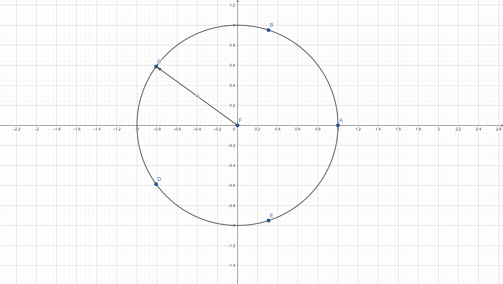

# **Группы**

## **Определение группы**.

Группой называется множество $M$ с заданной на нем алгебраической операцией $*$, для которой выполняются аксиома ассоциативности, аксиома нейтрального элемента и аксиома обратного элемента:

A1: $\forall a, b, c: a, b, c \in M \ \ \ \ \ (a * b) * c = a * (b * c)$

A2: $\exists!e: e\in M\ \ \forall a\in M\ \ \ \ \ a*e = e*a = a$

A3: $\forall a \in M\ \ \ \exists!b: b\in M\ \ \ \ \ b*a=a*b=e \ \rightarrow \ \  b = a^{-1}$

Элемент $b$  из аксиомы A3 называют обратным элементом к $a$ и обозначают $a^{-1}$ 

## Примеры групп 

- $\mathbf{Z}$ относительно операции сложения $+$: $G = <\mathbf{Z}, +>$

- $\mathbf{Q} \backslash \{0\}$ относительно операции умножения: $G = <\mathbf{Q} \backslash \{0\}, \cdot>$

- Остатки от деления на натуральное число $m$ относительно операции сложения

- Вектора в $\mathbf{R}^{n}$ относительно операции сложения

- Матрицы заданного размера относительно операции поэлементного сложения

- Квадратные невырожденные матрицы заданного размера относительно операции матричного умножения

- $\{True, False\}$ относительно операции $\oplus$

## Аддитивная и мультипликативная запись для групп

В теории групп очень гармонично вводятся понятия сложения или умножения как бинарной операции на множестве чисел. В связи с данным удобством принято различать несколько форм записи, никак не влияющие на структуру группы. Среди записей относительно записываемой операции различают *аддитивную* и *мультипликативную* зписи.

### Аддитивная запись для групп

Аддитивный вариант записи для группы $G = <M, +>$. Здесь $+$ не является заданной алгебраической операцией сложения на примере числового множества. *Здесь $+$ это просто заданная групповая операция*.

- $G = <M, +>$

- Нейтральный элемент: $e = 0$

- Обратный элемент к $a$: $-a$

- Последовательное ассоциативное применение $n$ раз групповой операции $+$ к элементу $a$ (**НЕ УМНОЖЕНИЕ $n$ на $a$**):

$$
na = a + a + \dots + a
$$

- $-na = -(na) = n(-a)$ -- *обратный элемент к результату $n$-кратного применения групповой операции к $a$* или нетрудно доказать что это равно *$n$-кратному применению групповой операции к обратному элементу $-a$*

### Мультипликативная запись для групп

Мультипликативный вариант записи для группы $G = <M, \cdot>$. Здесь $\cdot$ не является заданной алгебраической операцией умножения на примере числового множества. *Здесь $\cdot$ это просто заданная групповая операция*.

- $G = <M, \cdot>$

- Нейтральный элемент: $e = 1$

- Обратный элемент к $a$: $a^{-1}$

- Последовательное ассоциативное применение $n$ раз групповой операции $\cdot$ к элементу $a$ (**НЕ ВОЗВЕДЕНИЕ В СТЕПЕНЬ $n$ ЧИСЛА $a$**):

$$
a^{n} = a \cdot a \cdot \dots \cdot a
$$

- $a^{-n} = (a^{n})^{-1} = (a^{-1})^{n}$ *обратный элемент к результату $n$-кратного применения групповой операции к $a$* или нетрудно доказать что это равно *$n$-кратному применению групповой операции к обратному элементу $a^{-1}$*

## Задача 

Образуют ли группу отрезок $[0, 1]$ с операцией $\odot$, где $a \odot b$ -- дробная часть от $a + b$?

# **Коммутативность групп**

## Коммутативные группы

Говорят, что элементы $a$ и $b$ **коммутируют** относительно операции $*$ если выполняется:

$$
b * a = a * b
$$

**Абелева группа**. Группа называется **абелевой**, если все элементы группы коммутируют:

$$
\forall a,b: a,b\in M\ \ \ \ \ \ a*b = b*a
$$

## Примеры коммутативных групп

- Числовые группы относительно арифметических операций

- Группа квадратных диагональных матриц относительно операции сложения $A + B = B + A$, относительно операции поэлементного умножения $A \cdot B = B \cdot A$, относительно операции матричного умножения $A\  @\  B = B\  @\  A$.

- Повороты плоскости относительно центра координат $(x_0, y_0, z_0) = (0, 0, 0)$

# **Циклические группы**

## Определение

Группа называется *циклической*, если все элементы группы образуются посредством многократного применения операции к элементу группы $a$. В таком случае элемент группы $a$ называется **образующим** или **порождающим** элементом группы $G = <M, *>$.

$$
\exists a:a\in M\ \ \forall b: b\in M\ \ \exists k: k\in \mathbf{Z}\ \ \ \ b = a^{k}
$$

В аддитивной записи:

$$
\exists a:a\in M\ \ \forall b: b\in M\ \ \exists k: k\in \mathbf{Z}\ \ \ \ b = ka
$$


## Примеры 

- Множество $\mathbf{Z}_m, \ m \in \mathbf{N}$ относительно операции сложения: порождающий элемент $a = 1$. 

- Множество $\mathbf{Z}$ относительно операции сложения.

- Корни уравнения $x^{n} = 1,\ n \in \mathbf{N}$ в $\mathbf{C}$ относительно операции умножения $*$.

 Решения имеют вид:
 
  $x = exp(i\varphi k)$
  
  $\varphi = 2\pi / n$
  
  $k \in \{0,1, \dots, n-1\}$
  
  Нейтральный элемент $e = 1$ соответствует $k = 0$.
  
  

Хотя это то же самое, что и $M = \{e, a, a^2, a^3, \dots, a^{n-1}\},$ при условии $n \in \mathbf{N}$ и $a^{n} = e$.

В этом соотношении важную роль играет ассоциативность циклических групп.

## Теорема

```
Циклические группы коммутативны.
```

**Доказательство**:

Пусть $a$ называют порождающим элементом группы. 

Возьмем любые два элемента:

$$
\forall b,c \in M\ \ \ \ \exists k,t \in \mathbf{Z}\ \ \ \ \ b = a^{k}, c = a^{t}
$$
Теперь:

$$
b * c = a^{k} * a^{t}
$$

Используем ассоциативность:

$$
a^{k} * a^{t} = (a * a \dots * a) * (a * a * \dots * a) = a * a * \dots * a = a^{k + t} = a^{t + k} = a^t * a^{k} = c * b
$$

# **Порядок группы**

## Определение

Группа $G = <M, *>$ называется *конечной*, если в $M$ конечное число элементов или множество (носитель) $M$ -- конечное множество. 

**Порядком группы** называется число, обозначающее мощность носителя группы и обозначается: $|G| = cap\ G$/

## Примеры конечных групп

- Остатки от деления на натуральное число $m$ относительно операции сложения

- Ненулевые остатки от деления на простое число $p$ относительно операции умножения

- Группа поворотов относительно $(0, 0)$ на углы, кратные $\frac{\pi}{2}$


# **Таблицы Кэли**

Конечную группу $G = <M, *>,\ |G| = n$ можно полностью описать при помощи её таблицы умножения -- *таблицы Кэли*.

Правила:

- Все строки содержат различные элементы

- Все столбцы содержат различные элементы

$$
a * c = a * b \ \rightarrow a^{-1} * a * c = a^{-1}* a * b \ \rightarrow e * c = e* b \ \rightarrow b \ne c. 
$$
**Получили противоречие**

- Элементы по строкам действуют на элементы в столбцах

## Группы 2 на 2

При $n = 2$ в группе всего два элемента: $e, a$


Для $a$ должен существовать обратный элемент.

Группы с $|G| = 2$ -- циклические.

Группы с $|G| = 2$ -- коммутативные.

Группы из двух элементов описываются данной таблицей Кэли.

## Группы 3 на 3

При $n = 3$ в группе всего три элемента: $e, a, b$


Группы с $|G| = 3$ -- циклические.

Группы с $|G| = 3$ -- коммутативные.

Группы из трех элементов описываются данной таблицей Кэли.

## Группы 4 на 4

При $n = 4$ в группе всего четыре элемента: $e, a, b, c$


*Первая группа*

Пример такой группы -- $G = <M, \oplus>$, где $M = \{(0, 0), (0, 1), (1,0), (1, 1)\}$, а $\oplus$ -- покомпонентное сложение по модулю 2.

*Вторая группа* -- циклическая $C_4$ c порождающим элементом $a$ (элемент $c$ тоже порождающий)

Пример такой группы -- остатки от деления на 4 с операцией сложения по модулю 4. Такую группу часто обозначают $\mathbf{Z}_4$.

Группы с $|G| = 4$ -- коммутативные.

# Подгруппы

## Определение

Дана группа $G$. Подмножетсво $H \subseteq G$ называется *подгруппой* и обозначается $H < G$, если:

- $\exists e \in H: e \in G$

- $\forall a, b \in H\ \ \ a*b \in H$

- $\forall a\in H\ \ \ a^{-1} \in H$

Подгруппа $H < G$ является группой относительно той же групповой операции, что и $G$.

Оказывается, что можно проверить **критерий подгруппы** для доказательства того, что $H < G$:

## Критерий подгруппы

$$
H < G \rightleftarrows \forall a,b \in H \ \ \ a*b^{-1} \in H
$$

## Примеры

- Числа кратные $m\in \mathbf{N}$ в группе $G = <\mathbf{Z}, +>$

- В группе векторов в $\mathbf{R}^n$ относительно сложения любое подпространство является подгруппой.

- Группа поворотов в группе поворотов и отражений

- В конечной группе все степени произвольного элемента группы образуют подгруппу (иногда тривиальную)

## Смежные классы по подгруппе

Дана подгруппа $H < G$ и $x$ -- элемент $G$

**Левым смежным классом** по $H$ с представителем x:

$$
xH = \{y\ |\  y = x * h, \ h \in H\}
$$

**Правым смежным классом** по $H$ с представителем x:

$$
xH = \{y\ |\  y = h * x, \ h \in H\}
$$

Все возможные произведения конкретно заданного $x$ на элементы подгруппы.

## Теорема

**Теорема** (о смежных классах). Любые два левых (правых) смежных класса по подгруппе не пересекаются или совпадают. 

**Доказательство**. Давайте рассмотрим произвольные два смежных класса с представителями. Возьмем элемент который лежит и там и там:

$$
z \in xH, yH
$$

Покажем, что если есть один общий элемент, то эти множества просто совпадают:

$$
z \in xH, yH \rightarrow z = xh_1 = yh_2, \ \ h_1, h_2 \in H \rightarrow x = yh_2 h_1^{-1}
$$

Рассмотрим теперь произвольный элемент $xH$. Покажем, что он принадлежит также $yH$.

$$
t \in xH \rightarrow t = xh_t, \ h_t \in H \rightarrow t = (y h_2 h_1^{-1})h_t \rightarrow t = y (h_2 h_1^{-1}h_t), h_2 h_1^{-1}h_t \in H \rightarrow t \in yH
$$

**Пример**. Группу целых чисел относительно операции сложения по подмножеству четных чисел мы разбиваем на два смежных класса на подгруппу четных и нечетных чисел. 

Каждый элемент группы лежит в каком-то смежном классе. Смежные классы содержат столько же элементов сколько и подгруппа по которой происходило разбиение.

## Теорема (Лагранжа)

Пусть $H$ -- подгруппа конечной группы $G$, тогда

$$
    |G| = (G:H) |H|    
$$

Число $(G:H)$ обозначает количество смежных классов (левых или правых) в группе $G$ по подгруппе $H$ и называется **индексом подгруппы** $H$. 

- В группе простого порядка не существует нетривиальных подгрупп

- Все группы простого порядка являются циклическими

- Все группы порядка $p$ задаются одной и той же таблицей Кэли

## Порядок элемента

Дана группа $G$ говорят, что элемент $a \in G$ имеет *порядок* $m$, если $m$ наименьшее натуральное число, для которого выполняется $a^{m} = e$

- В циклической группе порядок порождающего элемента совпадает с порядком группы

- Порядок любого элемента конечной группы является делителем порядка группы

**Альтернативное определение порядка элемента**:

Дана группа $G$. Порядком элемента $a \in G$ назовём порядок подгруппы $H < G$, порожденной $а$.

```{r, echo=FALSE, include=FALSE}
'<iframe src="https://www.geogebra.org/calculator/dyvxcss3?embed" width="900" height="900" style="border: 1px solid #e4e4e4;border-radius: 4px;" frameborder="0"></iframe>'
```

# **Задачи**

- Найдите все подгруппы группы поворотов и отражений треугольника на плоскости относительно операции композиции элементов группы.

- Доказать, что во всякой группе пересечение любого набора подгрупп является группой

- Найти все подгруппы четверной группы Клейна $V_4$
