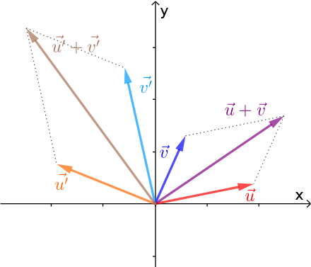

```{r setup, include=FALSE}
knitr::opts_chunk$set(echo = TRUE)
```


# **Примарный идеал**

## **Определение**

В коммутативной алгебре идеал $Q$ коммутативного кольца $A$ называется **примарным**, если он не совпадает со всем кольцом, и для любого элемента $Q$ вида $x\cdot y$ либо $x$, либо $y^n$ для некоторого $n>0$ также является элементом $Q$. Например, в кольце целых чисел $\mathbb{Z}$ **идеал примарен тогда и только тогда, когда он имеет вид $(p^n)$**, где $p$ — простое число.

Примарные идеалы важны в теории коммутативных колец, потому что любой идеал нётерова кольца имеет примарное разложение, то есть может быть записан как пересечение конечного числа примарных идеалов. Этот результат известен как теорема Ласкера — Нётер.

## **Примеры и свойства**

- Любой простой идеал является примарным.

- Идеал примарен тогда и только тогда, когда в факторкольце по нему любой делитель нуля является нильпотентным.

Элемент $x$ кольца $R$ называется **нильпотентным**, если существует положительное целое число $n$, такое, что ${\displaystyle x^{n}=0}$.

Минимальное значение ${\displaystyle n}$, для которого справедливо это равенство, называется **индексом нильпотентности элемента** ${\displaystyle a}$.


# **Тело**

**Тело** — кольцо с единицей, в котором каждый ненулевой элемент обратим. Иными словами, это множество с двумя операциями (сложение и умножение), обладающее следующими свойствами:

- образует абелеву группу относительно сложения;
 
- все ненулевые элементы образуют группу относительно умножения;

- имеет место дистрибутивность умножения относительно сложения.

Возникло как обобщение понятия поля (которое может быть определено как тело с коммутативным умножением). По теореме Веддербёрна всякое конечное тело является полем. Самый ${\displaystyle \mathbb {H} }$.

# **Модуль над кольцом**

## **Предисловие**

Мо́дуль над кольцо́м — одно из основных понятий в общей алгебре, являющееся обобщением двух алгебраических понятий — векторного пространства (фактически векторное пространство — это модуль над полем) и абелевой группы (которая является модулем над кольцом целых чисел ${\displaystyle \mathbb {Z} }$ ).

В векторном пространстве множество скаляров образует поле, и умножение на скаляр удовлетворяет нескольким аксиомам, таким как дистрибутивность умножения. В модуле же требуется только, чтобы скаляры образовывали кольцо (ассоциативное, с единицей), аксиомы же остаются теми же самыми.

Значительная часть теории модулей состоит из попыток обобщить на них известные свойства векторных пространств, иногда для этого приходится ограничиваться модулями над «хорошо ведущими себя» кольцами, такими как области главных идеалов. Однако в целом модули устроены более сложно, чем векторные пространства. Например, не в каждом модуле можно выбрать базис, и даже те, в которых это возможно, могут иметь несколько базисов с различным числом элементов (в случае некоммутативного кольца).

## **Определение**

Пусть ${\displaystyle R\ }$  — кольцо (как правило, считающееся коммутативным c единичным элементом ${\displaystyle 1\in R}$). ${\displaystyle R}$-модулем называется абелева группа ${\displaystyle M\ }$  с операцией умножения на элементы кольца ${\displaystyle R\ }$:

${\displaystyle R\times M\to M,\quad (r,m)\mapsto rm,}$,
которая удовлетворяет следующим условиям:

1) ${\displaystyle \forall m\in M,\,\forall r_{1},r_{2}\in R\quad (r_{1}r_{2})m=r_{1}(r_{2}m),}$
2) ${\displaystyle \forall m\in M\quad 1m=m.}$
3) ${\displaystyle \forall m_{1},m_{2}\in M,\,\forall r\in R\quad r(m_{1}+m_{2})=rm_{1}+rm_{2},}$,
4) ${\displaystyle \forall m\in M,\,\forall r_{1},r_{2}\in R\quad (r_{1}+r_{2})m=r_{1}m+r_{2}m.}$

Примечание: В случае некоммутативного кольца такие модули часто называются левыми. Правыми модулями называют в этом случае такие объекты, у которых условие 1) заменено следующим:

$$
{\displaystyle \forall m\in M,\,\forall r_{1},r_{2}\in R\quad (r_{1}r_{2})m=r_{2}(r_{1}m),}
$$

что гораздо удобнее формулировать, записывая элемент кольца справа от элемента модуля ${\displaystyle m}$:

$$
{\displaystyle \forall m\in M,\,\forall r_{1},r_{2}\in R\quad m(r_{1}r_{2})=(mr_{1})r_{2},}
$$


отсюда и терминология.

В случае коммутативного кольца ${\displaystyle R\ }$  определения левого и правого модуля совпадают, и их называют просто модулями.

Любое кольцо ${\displaystyle R\ }$  можно рассматривать как модуль над собой (в некоммутативном случае оно является также правым модулем над собой).

## **Связанные определения и свойства**

Подмодулем модуля ${\displaystyle M_{R}\ }$  называется подгруппа ${\displaystyle B\ }$  группы ${\displaystyle M\ }$, замкнутая относительно умножения на элементы из ${\displaystyle R\ }$, то есть такая, что:

$$
{\displaystyle \forall b\in B,\ r\in R\ :rb\in B}.
$$

Если кольцо ${\displaystyle R}$ рассматривать как левый модуль над собой, то его подмодули являются левыми идеалами; если кольцо рассматривать как правый модуль, то правыми идеалами. В коммутативном случае понятие левого и правого идеалов совпадают.

Гомоморфизмом, или ${\displaystyle R}$-гомоморфизмом,  ${\displaystyle R}$-модулей ${\displaystyle A}$ и ${\displaystyle B}$ называется гомоморфизм групп ${\displaystyle \phi :A\to B}$, для которого выполнено дополнительное условие ${\displaystyle \phi (ra) \ = \ r\phi(a), \quad \forall a\in A, \quad r\in R}$. Множество всех таких гомоморфизмов обозначают через ${\displaystyle Hom_{R}(A,\ B)}$. На этом множестве можно ввести структуру абелевой группы, определяя 0, ${\displaystyle -}$ и ${\displaystyle +}$ следующими равенствами:

$$
{\displaystyle 0a=0,\ (-\phi )a=-(\phi a),\ (\phi +\psi )a=\phi a+\psi a.}
$$

Если ${\displaystyle N}$ — подмодуль модуля ${\displaystyle M}$, можно рассмотреть фактормодуль ${\displaystyle M/N}$ как множество классов эквивалентности элементов ${\displaystyle M}$, определив отношение эквивалентности между элементами:

${\displaystyle a\sim b\ }$ тогда и только тогда, когда ${\ \displaystyle b-a\ }$ принадлежит ${\ \displaystyle N}$.


Элементы фактормодуля обычно обозначают как ${\displaystyle [a]=\{a+n:n\in N\}=a+N}$. Операции сложения и умножения определяются формулами 

$${\displaystyle (a+N)+(b+N)=(a+b+N),}$$

$$r\cdot (a+N)=(r\cdot a+N).$$

## **Примеры**

- Любая абелева группа — модуль над кольцом целых чисел.

- Любая ${\displaystyle n}$-ограниченная абелева группа (т. е. такая абелева группа ${\displaystyle A}$, что ${\displaystyle nA=0}$) — модуль над кольцом ${\displaystyle \mathbb {Z} _{n}}$ классов вычетов по модулю ${\displaystyle n}$.

- Линейное пространство над полем ${\displaystyle F}$ является модулем над ${\displaystyle F}$.

- Линейное пространство ${\displaystyle V}$ — модуль над кольцом всех своих линейных преобразований ${\displaystyle L(V)}$

- Если $I$ — левый идеал кольца $R$, он будет левым модулем над этим кольцом. Аналогично, правые идеалы будут правыми модулями.


# **Длина модуля**

## **Определение**

**Длина модуля** — способ измерения «размера» модуля, обобщающий понятие размерности векторного пространства. Длина определяется как максимальная длина цепочки вложенных подмодулей.

Пусть $M$ — (левый или правый) модуль над кольцом $R$. Мы говорим что длина цепочки его подмодулей вида

$${\displaystyle N_{0}\subsetneq N_{1}\subsetneq \cdots \subsetneq N_{n}}$$

равна $n$, то есть считаем число строгих включений, а не число подмодулей. Длина модуля $M$ — это наибольшая длина цепочки среди всех цепочек его подмодулей. Если наибольшей длины цепочки не существует, длина $M$ равна бесконечности.

## **Примеры**

- Единственный модуль длины 0 — нулевой модуль. Модули длины 1 называются простыми.

- Для конечномерного векторного пространства длина совпадает с размерностью.

- Длина циклической группы ${\displaystyle \mathbb {Z} /n\mathbb {Z} }$ равна числу множителей в разложении $n$ на простые.


# **Векторное пространство**

## **Предисловие**

**Векторное пространство** (линейное пространство) — математическая структура, представляющая собой набор элементов, называемых векторами, для которых определены операции сложения друг с другом и умножения на число — скаляр. Эти операции подчинены восьми аксиомам. Скаляры могут быть элементами вещественного, комплексного или любого другого поля чисел. Частным случаем подобного пространства является обычное трёхмерное евклидово пространство, векторы которого используются, к примеру, для представления физических сил. При этом вектор как элемент векторного пространства не обязательно должен быть задан в виде направленного отрезка. Обобщение понятия «вектор» до элемента векторного пространства любой природы не только не вызывает смешения терминов, но и позволяет уяснить или даже предвидеть ряд результатов, справедливых для пространств произвольной природы.

## **Определение**

Линейное, или векторное, пространство ${\displaystyle V(F)}$ над полем ${\displaystyle F}$ — это упорядоченная четвёрка ${\displaystyle (V,F,+,\cdot )}$, где

- ${\displaystyle V}$ — непустое множество элементов произвольной природы, которые называются векторами.

- ${\displaystyle F}$ — поле, элементы которого называются скалярами.

- Определена операция сложения векторов ${\displaystyle V\times V\to V}$, сопоставляющая каждой паре элементов ${\displaystyle \mathbf {x} ,\mathbf {y} }$  множества ${\displaystyle V}$ единственный элемент множества ${\displaystyle V}$, называемый их суммой и обозначаемый ${\displaystyle \mathbf {x} +\mathbf {y} }$.

- Определена операция умножения векторов на скаляры ${\displaystyle F\times V\to V}$, сопоставляющая каждому элементу ${\displaystyle \lambda }$  поля ${\displaystyle F}$ и каждому элементу ${\displaystyle \mathbf {x} }$  множества ${\displaystyle V}$ единственный элемент множества ${\displaystyle V}$, обозначаемый ${\displaystyle \lambda \cdot \mathbf {x} }$ или ${\displaystyle \lambda \mathbf {x} }$.

Заданные операции должны удовлетворять следующим аксиомам — аксиомам линейного (векторного) пространства:

1. ${\displaystyle \mathbf {x} +\mathbf {y} =\mathbf {y} +\mathbf {x} }$  для любых ${\displaystyle \mathbf {x} ,\mathbf {y} \in V}$ (коммутативность сложения);

2. ${\displaystyle \mathbf {x} +(\mathbf {y} +\mathbf {z} )=(\mathbf {x} +\mathbf {y} )+\mathbf {z} }$  для любых ${\displaystyle \mathbf {x} ,\mathbf {y} ,\mathbf {z} \in V}$ (ассоциативность сложения);

3. существует такой элемент ${\displaystyle \mathbf {0} \in V}$, что ${\displaystyle \mathbf {x} +\mathbf {0} =\mathbf {0} +\mathbf {x} =\mathbf {x} }$ для любого ${\displaystyle \mathbf {x} \in V}$ (существование нейтрального элемента относительно сложения), называемый нулевым вектором, или просто нулём, пространства ${\displaystyle V}$;

4. для любого ${\displaystyle \mathbf {x} \in V}$ существует такой элемент ${\displaystyle -\mathbf {x} \in V}$, что ${\displaystyle \mathbf {x} +(-\mathbf {x} )=\mathbf {0} }$, называемый вектором, противоположным вектору ${\displaystyle \mathbf {x} }$;

5. ${\displaystyle \alpha (\beta \mathbf {x} )=(\alpha \beta )\mathbf {x} }$  (ассоциативность умножения на скаляр);

6. ${\displaystyle 1\cdot \mathbf {x} =\mathbf {x} }$ (унитарность: умножение на нейтральный (по умножению) элемент поля ${\displaystyle F}$ сохраняет вектор).

7. ${\displaystyle (\alpha +\beta )\mathbf {x} =\alpha \mathbf {x} +\beta \mathbf {x} }$ (дистрибутивность умножения вектора на скаляр относительно сложения скаляров);

8. ${\displaystyle \alpha (\mathbf {x} +\mathbf {y} )=\alpha \mathbf {x} +\alpha \mathbf {y} }$ (дистрибутивность умножения вектора на скаляр относительно сложения векторов).

Таким образом, операция сложения задаёт на множестве ${\displaystyle V}$ структуру (аддитивной) абелевой группы.

Векторные пространства, заданные на одном и том же множестве элементов, но над различными полями, будут различными векторными пространствами (например, множество пар действительных чисел ${\displaystyle \mathbb {R} ^{2}}$ может быть двумерным векторным пространством над полем действительных чисел либо одномерным — над полем комплексных чисел).



## **Простейшие свойства**

1. Векторное пространство является абелевой группой по сложению.

2. Нейтральный элемент ${\displaystyle \mathbf {0} \in V}$ является единственным, что вытекает из групповых свойств.

3. ${\displaystyle 0\cdot \mathbf {x} =\mathbf {0} }$  для любого ${\displaystyle \mathbf {x} \in V}$.

4. Для любого ${\displaystyle \mathbf {x} \in V}$ противоположный элемент ${\displaystyle -\mathbf {x} \in V}$ является единственным, что вытекает из групповых свойств.

5. ${\displaystyle 1\cdot \mathbf {x} =\mathbf {x} }$  для любого ${\displaystyle \mathbf {x} \in V}$.

6. ${\displaystyle (-\alpha )\cdot \mathbf {x} =\alpha \cdot (-\mathbf {x} )=-(\alpha \mathbf {x} )}$ для любых ${\displaystyle \alpha \in F}$ и ${\displaystyle \mathbf {x} \in V}$.

7. ${\displaystyle \alpha \cdot \mathbf {0} =\mathbf {0} }$  для любого ${\displaystyle \alpha \in F}$.


## **Подпространства**

Алгебраическое определение: **Линейное подпространство**, или **векторное подпространство**, ― непустое подмножество ${\displaystyle K}$ линейного пространства ${\displaystyle V}$ такое, что ${\displaystyle K}$ само является линейным пространством по отношению к определённым в ${\displaystyle V}$ действиям сложения и умножения на скаляр. Множество всех подпространств обычно обозначают как ${\displaystyle \mathrm {Lat} (V)}$. Чтобы подмножество было подпространством, необходимо и достаточно, чтобы

1. для всякого вектора ${\displaystyle \mathbf {x} \in K}$ вектор ${\displaystyle \alpha \mathbf {x} }$  также принадлежал ${\displaystyle K}$ при любом ${\displaystyle \alpha \in F}$;

2. для всяких векторов ${\displaystyle \mathbf {x} ,\mathbf {y} \in K}$ вектор ${\displaystyle \mathbf {x} +\mathbf {y} }$  также принадлежал ${\displaystyle K}$.

Последние два утверждения эквивалентны следующему:

$$
\text{для всяких векторов }\  { \displaystyle \mathbf {x} ,\mathbf {y} \in K}\ \text{ вектор }\ {\displaystyle \alpha \mathbf {x} +\beta \mathbf {y} }\ \text{ также принадлежал }\ {\displaystyle K}\ \text{ для любых }\ {\displaystyle \alpha ,\beta \in F}.
$$

В частности, векторное пространство, состоящее из одного лишь нулевого вектора, является подпространством любого пространства; любое пространство является подпространством самого себя. Подпространства, не совпадающие с этими двумя, называют собственными, или нетривиальными.

## **Свойства подпространств**

- Пересечение любого семейства подпространств — снова подпространство;

- Сумма подпространств ${\displaystyle \{K_{i}\mid i\in 1\ldots N\}}$ определяется как множество, содержащее всевозможные суммы элементов ${\displaystyle K_{i}}$:

$${\displaystyle \sum _{i=1}^{N}{K_{i}}:=\{\mathbf {x} _{1}+\mathbf {x} _{2}+\ldots +\mathbf {x} _{N}\mid \mathbf {x} _{i}\in K_{i}\quad (i\in 1\ldots N)\}}.$$

- Сумма конечного семейства подпространств — снова подпространство.

## **Линейная зависимость**

Формальное выражение вида

$${\displaystyle \alpha _{1}\mathbf {x} _{1}+\alpha _{2}\mathbf {x} _{2}+\ldots +\alpha _{n}\mathbf {x} _{n}}$$

называется **линейной комбинацией элементов** ${\displaystyle \mathbf {x} _{1},\mathbf {x} _{2},\ldots ,\mathbf {x} _{n}\in V}$ с коэффициентами ${\displaystyle \alpha _{1},\alpha _{2},\ldots ,\alpha _{n}\in F}$.

В действительности данное определение (и приводимые ниже) приложимо не только к комбинациям векторов, но и к комбинациям любых других объектов, для которых подобные суммы вообще имеют смысл (например, к комбинациям точек аффинного пространства).

Линейная комбинация называется:

- **нетривиальной**, если хотя бы один из её коэффициентов отличен от нуля.

- **барицентрической**, если сумма её коэффициентов равна 1,

- **выпуклой**, если сумма её коэффициентов равна 1 и все коэффициенты неотрицательны,

- **сбалансированной**, если сумма её коэффициентов равна 0.

## **Базис, Размерность**

--------------------------------------

**Определение** (Линейная зависимость и независимость).


Векторы ${\displaystyle \mathbf {x}_{1},\mathbf {x}_{2},\ldots ,\mathbf {x}_{n}}$ называются **линейно зависимыми**, если существует их нетривиальная линейная комбинация, значение которой равно нулю; то есть

$${\displaystyle \alpha _{1}\mathbf {x} _{1}+\alpha _{2}\mathbf {x} _{2}+\ldots +\alpha _{n}\mathbf {x} _{n}=\mathbf {0},}$$

при некоторых ненулевых коэффициентах ${\displaystyle \alpha _{1},\alpha _{2},\ldots ,\alpha _{n}\in F.}$

В противном случае эти векторы называются **линейно независимыми**.

---------------------------------------------

Данное определение допускает следующее обобщение: бесконечное множество векторов из ${\displaystyle V}$ называется линейно зависимым, если линейно зависимо некоторое конечное его подмножество, и линейно независимым, если любое его конечное подмножество линейно независимо.

Можно показать, что **число элементов (мощность)** максимального линейно независимого множества элементов векторного пространства не зависит от выбора этого множества. Данное число **называется рангом, или размерностью, пространства**, а само это множество — **базисом** (базисом Га́меля, или линейным базисом). Элементы базиса именую  **базисными векторами**. Размерность пространства чаще всего обозначается символом ${\displaystyle {\rm {dim}}}$.

Таким образом, размерность векторного пространства является либо неотрицательным целым числом (в частности, равным нулю, если пространство состоит из одного лишь нулевого вектора), либо бесконечностью (точнее, мощностью бесконечного множества). В первом случае векторное пространство называется **конечномерным**, а во втором — **бесконечномерным** (например, бесконечномерным является пространство непрерывных функций). Традиционно изучение конечномерных векторных пространств и их отображений относится к линейной алгебре, а изучение бесконечномерных векторных пространств — к функциональному анализу. Во втором случае существенную роль играет вопрос о разложимости данного элемента по заданной бесконечной системе функций, то есть о сходимости соответствующих бесконечных сумм, для чего бесконечномерное векторное пространство рассматривается вместе с дополнительной структурой, позволяющей определять сходимость, например, с метрикой или топологией.

## **Свойства базиса**

- Любые ${\displaystyle n}$ линейно независимых элементов ${\displaystyle n}$-мерного пространства образуют базис этого пространства.

- Любой вектор $${\displaystyle \mathbf {x} \in V}$$ можно представить (единственным образом) в виде конечной линейной комбинации базисных элементов:

$${\displaystyle \mathbf {x} =\alpha _{1}\mathbf {x} _{1}+\alpha _{2}\mathbf {x} _{2}+\ldots +\alpha _{n}\mathbf {x} _{n}}.$$


## **Пространства, порожденные векторами**

Линейная оболочка ${\displaystyle {\mathcal {V}}(X)}$ подмножества ${\displaystyle X}$ линейного пространства ${\displaystyle V}$ — пересечение всех подпространств ${\displaystyle V}$, содержащих ${\displaystyle X}$.

Линейная оболочка является подпространством ${\displaystyle V}$.

Линейная оболочка также называется подпространством, порожденным ${\displaystyle X}$. Говорят также, что линейная оболочка ${\displaystyle {\mathcal {V}}(X)}$ — пространство, натянутое на множество ${\displaystyle X}$.

Линейная оболочка ${\displaystyle {\mathcal {V}}(X)}$ состоит из всевозможных линейных комбинаций различных конечных подсистем элементов из ${\displaystyle X}$. В частности, если ${\displaystyle X}$ — конечное множество, то ${\displaystyle {\mathcal {V}}(X)}$ состоит из всех линейных комбинаций элементов ${\displaystyle X}$. Таким образом, нулевой вектор всегда принадлежит линейной оболочке.

Если ${\displaystyle X}$ — линейно независимое множество, то оно является базисом ${\displaystyle {\mathcal {V}}(X)}$ и тем самым определяет его размерность.


```{r, error=FALSE, warning=FALSE, echo=FALSE}
x <- c((-6):6)
x_C <- c((-6):(-1), 1:6)
df <- expand.grid(x1 = x_C, x2 = x_C)
plot(0, 0, type="n", xlim = c(-4, 4), ylim = c(-4, 4), asp = 1, xlab = "", ylab = "", axes = FALSE)
abline(h = x, lty = 2, lwd = I(0.5), col = "gray")
abline(v = x, lty = 2, lwd = I(0.5), col = "gray")
arrows(x0 = c(0, 0), x1 = c(0, 1), y0 = c(0, 0), y1 = c(1, 0), col = "red", length = I(0.1))
arrows(x0 = 0, y0 = 0, x1 = df[[1]], y1 = df[[2]], length = I(0.05), lty = 1, lwd = I(0.5))
```


## **Изоморфизм** 

Два линейных пространства ${\displaystyle V'(F)}$ и ${\displaystyle V''(F)}$ называются изоморфными, если между векторами ${\displaystyle x'\in V'}$ и ${\displaystyle x''\in V''}$ можно установить взаимно однозначное соответствие таким образом, что выполняются условия:

1. если вектору ${\displaystyle \mathbf {x} '\in V'}$ соответствует вектор ${\displaystyle \mathbf {x} ''\in V''}$, а вектору ${\displaystyle \mathbf {y} '\in V'}$ соответствует вектор ${\displaystyle \mathbf {y} ''\in V''}$, то вектору ${\displaystyle \mathbf {x} '+\mathbf {y} '\in V'}$ соответствует вектор ${\displaystyle \mathbf {x} ''+\mathbf {y} ''\in V''}$

2. если вектору ${\displaystyle \mathbf {x} '\in V'}$ соответствует вектор ${\displaystyle \mathbf {x} ''\in V''}$, и ${\displaystyle \lambda }$  - элемент поля ${\displaystyle F}$, то вектору ${\displaystyle \lambda \mathbf {x} '\in V'}$ соответствует вектор ${\displaystyle \lambda \mathbf {x} ''\in V''}$

## **Примеры**

- Нулевое пространство, единственным элементом которого является ноль.

- Пространство всех функций ${\displaystyle X\to F}$ с конечным носителем образует векторное пространство размерности, равной мощности ${\displaystyle X}$.

- **Поле действительных чисел** $\mathbb{R}$ может быть рассмотрено как континуально-мерное векторное пространство $\mathbb{V}$ над полем рациональных чисел $\mathbb{Q}$.

- Любое поле является одномерным пространством над собой.

- Пространства матриц и тензоров образуют линейное пространство.


# **Прямая сумма векторных пространств** 

## **Предисловие**

**Прямая сумма** — производный математический объект, создаваемый по определённым ниже правилам из базовых объектов. В качестве базовых чаще всего выступают векторные пространства или абелевы группы.

Прямая сумма двух объектов ${\displaystyle A}$ и ${\displaystyle B}$ обозначается ${\displaystyle A\oplus B}$, а прямая сумма произвольного множества объектов ${\displaystyle A_{i}}$ — как ${\displaystyle \bigoplus _{i\in I}A_{i}}$. При этом произвольное ${\displaystyle A_{i}}$ называется прямым слагаемым ${\displaystyle \bigoplus _{i\in I}A_{i}}$.

## **Определение**

Говорят, что линейное пространство ${\displaystyle X}$ есть прямая сумма своих подпространств ${\displaystyle M_{1},\dots ,M_{n}}$:

$${\displaystyle X=M_{1}\oplus \dots \oplus M_{n},}$$
если каждый вектор ${\displaystyle x\in X}$ представляется в виде суммы

$${\displaystyle x=m_{1}+\dots +m_{n},\quad m_{i}\in M_{i},\quad (\ast )}$$

и притом единственным образом.

## **Примеры**

- Трёхмерное линейное пространство является прямой суммой плоскости (то есть двумерного подпространства) и любой прямой (одномерного подпространства), не лежащей в этой плоскости, а также прямой суммой любых трёх не лежащих в одной плоскости прямых. Трёхмерное линейное пространство является суммой двух несовпадающих плоскостей, но не является их прямой суммой, так как пересечение плоскостей даёт прямую (и поэтому нулевой вектор может быть представлен бесконечным числом способов: ${\displaystyle 0=m_{1}+m_{2}}$, где ${\displaystyle m_{1}}$ и ${\displaystyle m_{2}}$ — противоположные векторы на этой прямой).

- Пространство многочленов степени не больше ${\displaystyle n}$ (от фиксированного числа переменных) может быть представлено в виде прямой суммы ${\displaystyle M_{0}\oplus M_{1}\oplus \cdots \oplus M_{n},}$ где ${\displaystyle M_{i}}$ — подпространство однородных многочленов степени ${\displaystyle i}$. Если в определении ${\displaystyle M_{i}}$ убрать условие однородности, то сумма перестанет быть прямой.

## **Прямая сумма конечного числа пространств**

Понятие прямой суммы ${\displaystyle X=M_{1}\oplus \dots \oplus M_{n}}$ распространяется на случай, когда ${\displaystyle M_{1},\dots ,M_{n}}$ изначально не являются подпространствами какого-либо одного объемлющего линейного пространства. Чтобы избежать путаницы, прямая сумма в этом смысле называется внешней прямой суммой, тогда как прямая сумма подпространств называется внутренней прямой суммой.

Пусть ${\displaystyle M_{1},\ldots M_{n}}$ — векторные пространства над полем ${\displaystyle K}$. Определим множество-носитель ${\displaystyle X}$ как декартово произведение множеств ${\displaystyle X=M_{1}\times \dots \times M_{n}}$ и введём на нём операции векторного пространства с помощью формул

$${\displaystyle (x_{1},\ldots ,x_{n})+(y_{1},\ldots ,y_{n})=(x_{1}+y_{1},\ldots ,x_{n}+y_{n})\quad x_{i},y_{i}\in M_{i}\quad (*)}$$

$${\displaystyle \alpha (x_{1},\ldots ,x_{n})=(\alpha x_{1},\ldots ,\alpha x_{n}),\quad x_{i}\in M_{i},\alpha \in K\quad (**)}$$ 

Для каждого ${\displaystyle i}$ существуют естественные вложения ${\displaystyle f:M_{i}\to X}$, такие что ${\displaystyle f(M_{i})}$ — это в точности множество тех векторов, все координаты которых в прямом произведении, кроме ${\displaystyle i}$-й координаты, равны нулю. Если отождествить пространства ${\displaystyle M_{i}}$ с соответствующими подпространствами в ${\displaystyle X}$, каждый вектор ${\displaystyle x\in X}$ однозначно представим в виде ${\displaystyle x=m_{1}+\dots +m_{n}, \quad}$ ${\displaystyle m_{i}\in M_{i},}$ следовательно, ${\displaystyle X}$ является внутренней прямой суммой ${\displaystyle M_{i}}$.

Аналогичным образом определяется прямая сумма модулей над кольцом ${\displaystyle K}$ (и, в частности, прямая сумма абелевых групп, являющихся модулями над кольцом целых чисел).

## **Прямая сумма произвольного множества пространств**

Только при рассмотрении прямой суммы бесконечного числа пространств проявляется её отличие от прямого произведения этих пространств. Пусть ${\displaystyle M_{i}}$ — индексированное семейство векторных пространств над полем ${\displaystyle K}$, тогда их прямая сумма — это множество **конечных** формальных сумм

$${\displaystyle \sum \limits _{i\in I}x_{i},\;x_{i}\in M_{i}}$$
с покомпонентными операциями сложения и с операцией умножения на скаляр ${\displaystyle \alpha \in K}$:

$${\displaystyle \alpha (\sum _{i\in I}x_{i})=\sum _{i\in I}\alpha x_{i}}.$$
Очевидно, сумма двух конечных сумм — вновь конечная сумма, поэтому прямая сумма замкнута относительно операций векторного пространства. Для того чтобы определить прямую сумму модулей, достаточно поле ${\displaystyle K}$ заменить на некоторое кольцо.

## **Свойства прямой суммы**

- Если векторное пространство ${\displaystyle X}$ конечномерно, то ${\displaystyle \dim X=\dim M_{1}+\ldots +\dim M_{n}}$. Аналогичные утверждения верны для ранга абелевой группы и длины модуля.


- Объединение базисов линейных подпространств ${\displaystyle M_{i}\;(i=1,\dots ,n}$ есть базис ${\displaystyle X}$.

- Каждое векторное пространство над полем ${\displaystyle K}$ изоморфно прямой сумме некоторого множества копий ${\displaystyle K}$. Также это верно для свободных модулей.

- Операция прямой суммы двух пространств коммутативна и ассоциативна с точностью до изоморфизма.

- Группа K-линейных гомоморфизмов из прямой суммы пространств изоморфна произведению групп гомоморфизмов из отдельных пространств:
$${\displaystyle \operatorname {Hom} _{K}{\biggl (}\bigoplus _{i\in I}M_{i},L{\biggr )}\cong \prod _{i\in I}\operatorname {Hom} _{K}\left(M_{i},L\right).}$$

В частности, пространство, двойственное к прямой сумме пространств, изоморфно произведению пространств, двойственных к компонентам прямой суммы. Под **произведением** здесь понимается **прямое произведение носителей** или декартово произведение аналогичных алгебраических структур.

# **Модули коразмерности**

## **Коразмерность**

В математике коразмерность - это основная геометрическая идея, которая применима к подпространствам в векторных пространств, подмногообразиям в многообразиях и подходящим подмножествам алгебраических многообразий.

Для аффинных и проективных алгебраических многообразий коразмерность равна высоте определяющего идеала. По этой причине высоту идеала часто называют его коразмерностью.

-----------------------------------

**Определение**

**Коразмерность** - понятие относительное: она определяется только для одного объекта внутри другого. Нет никакой “коразмерности векторного пространства (изолированно)”, есть только коразмерность векторного подпространства.

Если $W$ - линейное подпространство конечномерного векторного пространства V, то коразмерность W в V - это разность измерений:

$${\displaystyle \operatorname {codim} (W)=\dim(V)-\dim(W).}$$

Это дополнение к размерности $W$ в том смысле, что вместе с размерностью $W$ оно складывается с размерностью окружающего пространства $V$:

$${\displaystyle \dim(W)+\operatorname {codim} (W)=\dim(V).}$$

--------------------------------------------------------------

В более общем смысле, если $W$ является линейным подпространством (возможно, бесконечномерного) векторного пространства $V$, то коразмерность $W$ в $V$ является размерностью (возможно, бесконечной) фактор-пространства $V / W$, которое более абстрактно известно как **коядро включения**. Для конечномерных векторных пространств это согласуется с предыдущим определением

$${\displaystyle \operatorname {codim} (W)=\dim(V/W)=\dim \operatorname {coker} (W\to V)=\dim(V)-\dim(W),}$$

и двойственна относительной размерности как размерности ядра.

Конечномерные подпространства бесконечномерных пространств часто полезны при изучении топологических векторных пространств.

