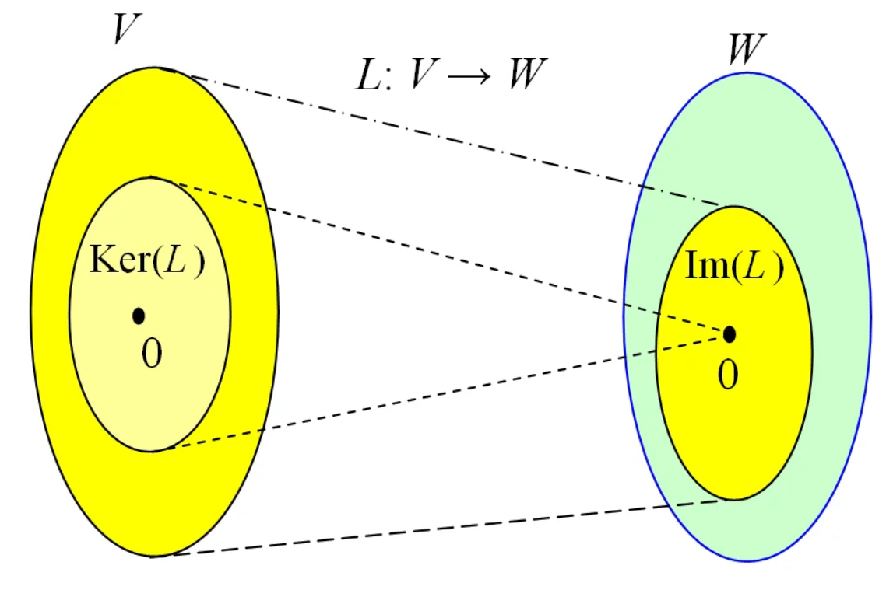
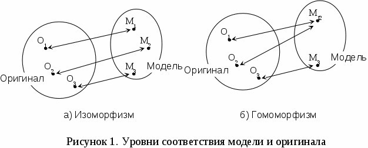

```{r setup, include=FALSE}
knitr::opts_chunk$set(echo = TRUE)
```

# Отображение групп. Изоморфизм групп. Гомоморфное отображение. Операции, осуществляемые гомоморфизмами.

## **Прямое произведение групп**

Даны $G = <M, *>$ и $H = <M^{'}, \circ>$, прямое произведение $G × H$ определяется следующим образом:

$$
  G \times H = <M \times M^{'}, (*, \circ)>\\
  \forall a,b,c \in G,\ \forall d, e, f \in H \ \ \ (a * b,\ d \circ e) = (c,\ f) \in G\times H 
$$

A1:   $\forall a,b,c,t \in G,\ \forall d, e, f, l \in H \ \ \ (a * (b * t),\ d \circ (e \circ l)) = ((a * b) * t,\ (d \circ e) \circ l) = (c,\ f) \in G\times H$ 

A2:   $(e_G, e_H)$

A3:   $(a, d)\  |\ (a^{-1}, d^{-1})$

### Примеры

1. Пусть $R$ -- группа вещественных чисел по сложению. Прямое произведение $R \times R$ - это группа векторов размерности 2 и операцией сложения векторов

## **Нормальные подгруппы**

**Нормальная подгруппа (инвариантная группа, нормальный делитель)** -- подгруппа особого типа, левый и правый смежный классы по которой совпадают.

Подгруппа $N$ группы $G$ называется **нормальной**, если она инвариантна относительно групповой операции на элемент группы и на обратный к нему

$$
N < G \ \ \ \ \forall n \in N, \ \ \ \forall g \in G \ \ \ \ gng^{-1} \in N \\
$$

Условия нормальности подгруппы

1.    $\forall g \in G: \ gNg^{-1} \subseteq N$  

2.    $\forall g \in G: \ gNg^{-1} \equiv N$

3.    Множества левых и правых смежных классов $N$ в $G$ совпадают

4.    $\forall g \in G: gN = Ng$

Условие (1) логически слабее, чем (2), а условие (3) логически слабее, чем (4). Поэтому условия (1) и (3) часто используются при доказательстве нормальности подгруппы, а условия (2) и (4) используются для доказательства следствий нормальности.

### Примеры 

1. Тривиальные подгруппы всегда нормальные подгруппы. Если других нормальных подгрупп нет, то $G$ называется **простой группой**

2. **Центр группы** -- нормальная подгруппа.

----------------------------------------------

**Центр группы** в теории групп — множество всех таких элементов данной группы, которые коммутируют со всеми её элементами:

$$
  {\displaystyle Z(G)=\{z\in G\mid \forall g\in G,zg=gz\}}.
$$

Группа ${\displaystyle G}$ является абелевой в том и только в том случае, когда её **центр** совпадает с ней: ${\displaystyle Z(G)=G}$; в этом смысле центр группы может быть рассмотрен как мера её «абелевости» (коммутативности). Говорят, что группа не имеет центра, если центр группы тривиален, то есть состоит только из нейтрального элемента.

Элементы центра иногда называют центральными элементами группы.

----------------------------------------------

3. Группа параллельных переносов в пространстве любой размерности — нормальная подгруппа евклидовой группы; например, в трёхмерном пространстве поворот, сдвиг и поворот в обратную сторону приводит к простому сдвигу.

4. В **группе кубика Рубика** подгруппа, состоящая из операций, действующих только на угловые элементы, нормальна, так как никакое сопряжённое преобразование не заставит такую операцию действовать на краевой, а не угловой элемент. Напротив, подгруппа, состоящая лишь из поворотов верхней грани, не нормальна, так как сопряжения позволяют переместить части верхней грани вниз.

## **Отображение групп**

**Отображение групп** -- некоторое правило, по которому элементы одного множества сопоставляются элементам другого множества, однако, такое отображение сохраняет групповую операцию. 

Пусть у нас заданы две группы: $G = <M, *>$ и $G^{'} = <M^{'}, \circ>$, тогда отображение $\varphi$ будет действовать согласно правилу:

$$
  \varphi: G \rightarrow G^{'}\\
  \forall a, b \in G, \ \ \  \exists\ \varphi(a), \varphi(b) \in G^{'}: \varphi(a * b) = \varphi(a) \circ \varphi(b) 
$$

## **Ядро и образ оператора отображения**

**Ядро отображения** -- подмножество элементов множества $G$, которые перешли в нейтральный элемент другого множества $G^{'}$ в результате отображения $\varphi$:

$$
  \varphi: G \rightarrow G^{'} \ \ \ \   ker(\varphi) = \{g \in G\ | \ \varphi(g) = e_{G^{'}}\}
$$

**Образ отображения** -- подмножество элементов множества $G^{'}$ не являющиеся нейтральными, которые перешли из множества $G$ посредством отображения $\varphi$:

$$
   \varphi: G \rightarrow G^{'} \ \ \ \   im(\varphi) = \{\varphi(a) \in G^{'}\ |\  a \in G\}
$$



**NB**. Стоит сделать оговорку, что операции внутри своих групп при переходе сохраняются.


## **Гомоморфизм групп. Гомоморфное отображение**

Если заданы две группы $G = <M, *>$ и $G^{'} = <M^{'}, \circ>$, **гомоморфизм групп** из $G$ в $G^{'}$ -- это функция $\varphi: G \rightarrow G^{'}$ такая что $\forall a, b \in G$ выполняется:

$$
  h(a * b) = h(a) \circ h(b).
$$

Функция $\varphi$ отображает нейтральный элемент $e_{G}$ группы $G$ в нейтральный элемент $e_{G^{'}}$ группы $G^{'}$, а также отображает элементы в обратные в том смысле, что:

$$
  h(a^{-1}) = h(a)^{-1}
$$

Таким образом, можно сказать, что $\varphi$ *сохраняет групповую структуру*


*Цель определения гомоморфизма группы* — создать функции, сохраняющие алгебраическую структуру. 

**Эквивалентное определение гомоморфизма группы**: Функция $\sigma : G → G^{'}$ является гомоморфизмом группы, если из $a ∗ b = c$ следует $\sigma(a) ⋅\sigma(b) = \sigma(c)$. Другими словами, группа $G^{'}$ в некотором смысле подобна алгебраической структуре $G$ и гомоморфизм $\sigma$ сохраняет её.

### Виды гомоморфных отображений

1. Если гомоморфизм $\varphi$ является *биекцией*, то можно показать, что обратное отображение тоже является гомоморфизмом групп, и тогда $\varphi$ называется *изоморфизмом*. В этом случае группы $G$ и $G^{'}$ называются *изоморфными* — они различаются только обозначением элементов и операции и идентичны для практического применения.

2. Если $\varphi: G → G$ является гомоморфизмом групп, мы называем его *эндоморфизмом* $G$. Если же оно и биективно, а следовательно, является изоморфизмом, оно называется *автоморфизмом*.

3. **Эпиморфизм** — это *сюръективный гомоморфизм*, то есть гомоморфизм. *Мономорфизм* — это инъективный гомоморфизм, то есть гомоморфизм один-к-одному.


### Примеры

1. Возьмём циклическую группу $\mathbb{Z}/3\mathbb{Z} = \{0, 1, 2\}$ и группу целых чисел $Z$ по сложению. Отображение $h : \mathbb{Z} → \mathbb{Z}/3\mathbb{Z}$ с $h(u) = u\{n\}, \ n \in \mathbb{N}$ является гомоморфизмом. Оно сюръективно и его ядро состоит из целых чисел, делящихся на $n$.

2. Возьмём группу положительных вещественных чисел с операцией умножения $(\mathbb{R}^+, \cdot)$ . Для любого комплексного числа $u \in \mathbb{C}$ функция $f_u : \mathbb{R}^+ → \mathbb{C}$, определённая как

$${\displaystyle f_{u}(a)=a^{u}}$$
является гомоморфизмом.

3. Экспоненциальное отображение

$$
f(x) = e^x
$$
является гомоморфизмом из группы вещественных чисел $\mathbb{R}$ по сложению в группу ненулевых вещественных чисел $\mathbb{R}^*$ по умножению. Ядром является множество $ker(f) = \{0\}$, а образ $im(f) = \{\mathbb{R}^+\}$ состоит из вещественных положительных чисел.


## **Изоморфизм групп**

**Изоморфизм групп** -- взаимно-однозначное соответствие между элементами двух групп, сохраняющее групповые операции. Если существует изоморфизм между двумя группами, группы называются изоморфными. С точки зрения теории групп изоморфные группы имеют одни и те же свойства и их можно не различать


Две группы $<G, ∗>$ и $<G^{'}, \circ>$ изоморфны, если существует изоморфизм из одной в другую. Это записывается следующим образом:


$${\displaystyle <G,*>\cong <G^{'}, \circ>}$$


### Примеры




1. Группа всех вещественных чисел по сложению, ${\displaystyle <\mathbb {R} ,+>}$, изоморфна группе всех положительных вещественных чисел по умножению ${\displaystyle <\mathbb {R} ^{+},\cdot >}$:

$$
{\displaystyle <\mathbb {R} ,+>\cong <\mathbb {R}^{+},\cdot >}
$$

посредством изоморфизма

$${\displaystyle f(x)=e^{x}}.$$

2. Группа ${\displaystyle \mathbb {Z} }$  целых чисел (по сложению) является подгруппой ${\displaystyle \mathbb {R} }$, а факторгруппа ${\displaystyle \mathbb {R} /\mathbb {Z}}$ изоморфна группе ${\displaystyle S^{1}}$ комплексных чисел с абсолютной величиной 1 (по умножению):

${\displaystyle <\mathbb {R} /\mathbb {Z} ,+>\cong <S^{1},\cdot >}$

Изоморфизм задаётся выражением

$${\displaystyle f(x+\mathbb {Z} )=e^{2\pi xi}}$$

для любого $\forall x \in {\displaystyle \mathbb {R} }$

3. Четверная группа Клейна изоморфна прямому произведению двух копий ${\displaystyle \mathbb {Z} _{2}=\mathbb {Z} /2\mathbb {Z} }$, а следовательно, может быть записана как ${\displaystyle \mathbb {Z} _{2}\times \mathbb {Z} _{2}}$.

## **Фактормножество**

**Определение**. Бинарное отношение $R$ на множестве $A$ называется *отношением эквивалентности* на множестве $A$, если оно рефлексивно, симметрично и транзитивно на множестве $A$.

**Пример**

1. $A$ -- множество прямых на плоскости. Отношение параллельности $R = \{<x, y>\ |\ x, y \in A: x \ ||\ y\}$ на множестве $A$ есть отношение эквивалентности.

2. $\mathbb{Z}$ -- множество целых чисел $m \in \mathbb{Z}, m \ne 0$. Отношение $R = \{<x, y>\ |\ x, y \in \mathbb{Z}: (x - y)\ \vdots \ m \}$ -- называется отношением сравнения по модулю $m$. $R$ -- отношение эквивалентности на $Z$.

3. Отношение подобия на множестве треугольников данной плоскости есть отношение эквивалентности.

**Определение**. Пусть $R$ -- отношение эквивалентности на $A$ и $a \in A$. **Классом эквивалентности**, порожденным элементом $a$, называется множество $\{x \in A\ | \ xRa\}$, то есть множество всех таких элементов $a$ из множества $A$, что $<x, a> \in R$.

Совокупность всех классов эквивалентности отношения $R$ на множестве $A$ обозначается через $A/R$

**Пример**

1. $A$ -- множество прямых на плоскости. Отношение параллельности $R = \{<x, y>\ |\ x, y \in A: x \ ||\ y\}$ на множестве $A$ есть отношение эквивалентности. Классы эквивалентности -- пучки параллельных прямых

2. $\mathbb{Z}$ -- множество целых чисел $m \in \mathbb{Z}, m \ne 0$. Отношение $R = \{<x, y>\ |\ x, y \in \mathbb{Z}: (x - y)\ \vdots \ m \}$ -- называется отношением сравнения по модулю $m$. $R$ -- отношение эквивалентности на $Z$. Классы эквивалентности -- классы вычетов по модулю $m$ и каждый класс состоит из всех чисел, которые при делении на $m$ дают один и тот же остаток.

3. Отношение подобия на множестве треугольников данной плоскости есть отношение эквивалентности. Классы эквивалентности -- множество попарно подобных треугольников.

**Определение**. Фактор-множеством множества $A$ по отношению эквивалентности $R$ называется множество $A/R$ всех классов эквивалентности.

## **Факторгруппа**

**Факторгруппа** — множество смежных классов группы по её нормальной подгруппе, само являющееся группой с определённой специальным образом групповой операцией.

Факторгруппа группы ${\displaystyle G}$ по нормальной подгруппе ${\displaystyle H}$ обычно обозначается ${\displaystyle G/H}$.

Образ группы при гомоморфизме изоморфен её факторгруппе по ядру этого гомоморфизма.

**Определение**

Пусть ${\displaystyle G}$ — группа, ${\displaystyle H}$ — её нормальная подгруппа и ${\displaystyle a\in G}$ — произвольный элемент. Тогда на классах смежности ${\displaystyle H}$ в ${\displaystyle G}$

$${\displaystyle aH=\{\,ah\mid \,h\in H\}}$$

можно ввести умножение:

$${\displaystyle (aH)(bH)=abH}$$

Легко проверить что это умножение не зависит от выбора элементов в классах смежности, то есть если ${\displaystyle aH=a'H}$ и ${\displaystyle bH=b'H}$, то ${\displaystyle abH=a'b'H}$. Это умножение определяет структуру группы на множестве классов смежности, а полученная группа ${\displaystyle G/H}$ называется факторгруппой ${\displaystyle G}$ по ${\displaystyle H}$.

### Свойства

1. Теорема о гомоморфизме: Для любого гомоморфизма ${\displaystyle \varphi :G\to K}$

$${\displaystyle G/\mathrm {Ker} \,\varphi \cong \varphi (G)}$$

то есть факторгруппа ${\displaystyle G}$ по ядру ${\displaystyle \mathrm {Ker} \,\varphi }$  изоморфна её образу ${\displaystyle \varphi (G)}$ в ${\displaystyle K}$.

2. Отображение ${\displaystyle a\mapsto aH}$ задаёт естественный гомоморфизм ${\displaystyle G\to G/H}$.

3. Порядок ${\displaystyle G/H}$ равен индексу подгруппы ${\displaystyle [G:H]}$. В случае конечной группы ${\displaystyle G}$ он равен ${\displaystyle |G|/|H|}$.

4. Если ${\displaystyle G}$ абелева, нильпотентна, разрешима, циклическая или конечнопорождённая, то и ${\displaystyle G/H}$ будет обладать тем же свойством.

5. ${\displaystyle G/G}$ изоморфна тривиальной группе $({\displaystyle \{e\}})$, ${\displaystyle G/{e}}$ изоморфна ${\displaystyle G}$.

### Примеры

1. Пусть ${\displaystyle G=S_{4}}$ (симметрическая группа), ${\displaystyle H=V_{4}}$ (четверная группа Клейна, состоящая из перестановок $\{e, (12)(34), (13)(24), (14)(23)\}$) тогда ${\displaystyle G/H}$ изоморфна ${\displaystyle S_{3}}$.

2. Пусть ${\displaystyle G=\mathbb {Z} }$, ${\displaystyle H=n\mathbb {Z} }$, тогда ${\displaystyle G/H}$ изоморфна ${\displaystyle \mathbb {Z} _{n}}$

Группа $\mathbb{Z}_n$ вычетов по модулю $n$ как фактор-группа группы $<\mathbb{Z}, +>$ по подгруппе $n\mathbb{Z}$. Пусть $G = \mathbb{Z}$ — группа целых чисел с операцией сложения, $n$ — натуральное число и $H = n\mathbb{Z} = \{nq\ |\ q ∈ \mathbb{Z}\}$ — подгруппа целых
чисел, делящихся на $n$.

Для $k \in \mathbb{Z}$ рассмотрим смежный класс

$$C_k = k + n\mathbb{Z} = \{k + nq\ |\ q \in \mathbb{Z}\}.$$
Ясно, что $C_k = C_l$ для $l \in \mathbb{Z}$ тогда и только тогда, когда $k − l = nq$. Так как $k = nq + r$, где $q \in \mathbb{Z}$, $0≤r<n$, то $C_k = C_r$. Таким образом, множество всех различных смежных классов $\mathbb{Z}_n = G/H = \mathbb{Z}/n\mathbb{Z} = \{C_0, C_1, . . . , C_{n−1}\}$ находится в биективном соответствии с остатками $\{0, 1, 2, . . . , n − 1\}$ при делении на число $n$. Если $k, l \in \mathbb{Z}$ и $k + l = nq + r$, то


$$C_k + C_l = (k + n\mathbb{Z}) + (l + n\mathbb{Z}) = (k + l) + n\mathbb{Z} = r + n\mathbb{Z} = C_r.$$


## **Задачи**

1. Доказать, что непрерывные строго возрастающие функции $\varphi$ со значениями $\varphi(0) = 0$, $\varphi(1) = 1$ составляют группу относительно суперпозиции. Привести примеры таких функций.

2. Установить изоморфизм группы вещественных чисел относительно сложения и группы положительных чисел относительно умножения.

3. Какие из отображений групп $f: \mathbb{C}^{*} \rightarrow \mathbb{R}^{*}$ являются гомоморфизмами:

a. $f(z) = |z|$

b. $f(z) = 2 |z|$

c. $f(z) = \frac{1}{|z|}$

d. $f(z) = 1 + |z|$

e. $f(z) = |z^2|$

f. $f(z) = 1$

j. $f(z) = 2$

4. Найти все гомоморфные отображения

a. $\mathbb{Z}_6 \rightarrow \mathbb{Z}_6$

b. $\mathbb{Z}_{6} \rightarrow \mathbb{Z}_{18}$

c. $\mathbb{Z}_{18} \rightarrow \mathbb{Z}_{6}$

d. $\mathbb{Z}_{12} \rightarrow \mathbb{Z}_{15}$

e. $\mathbb{Z}_{6} \rightarrow \mathbb{Z}_{25}$
