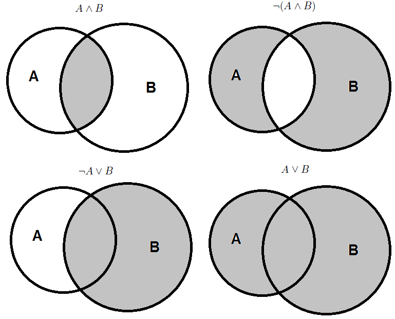
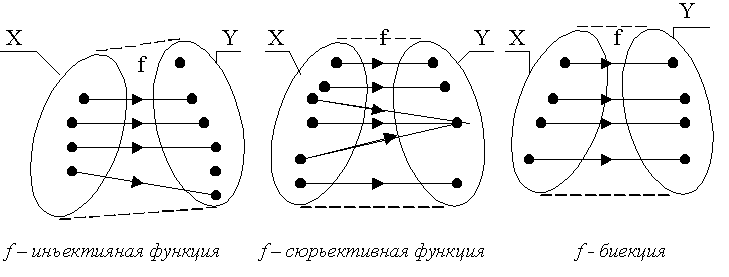
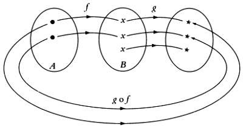

## Основные понятия теории множеств

**Множество** - совокупность вполне определённых различаемых объектов, рассматриваемых как единое целое.

Отдельные объекты, из которых состоит множество, называются **элементами множества**.

Множества принято обозначать большими буквами латинского алфавита, элементы этих множеств -- маленькими. Множества записываются в \{\} фигурных скобках.

### Обозначения

- $a \in L$ -- элемент $a$ принадлежит множеству $L$

- $a \notin L$ -- элемент $a$ не принадлежит множеству $L$

- $\forall$ -- любой, каждый, для всех

- $\exists$ -- существует

- $\exists !$ -- существование и единственность

- $:$ -- такой что, обладающий свойством

- $\rightarrow$ -- следствие, влечет за собой

- **$\leftrightarrow$** -- эквивалентность, равносильность, тогда и только тогда

- **$\emptyset$** -- пустое множество

- **$\Omega$** -- универсальное множество

- $\subseteq$ -- подмножество множества (или равенство)

- $\subset$ -- подмножество множества (строго)

- $\sim$ -- сравнимость множеств

## Классы множеств

Множества бывают *конечные* и *бесконечные*.

Множество называют *конечным*, если число его элементов конечно, т.е. если $\exists \nu \in \mathbf{N}: A = \left\{ a_1, a_2, \dots, a_{\nu} \right\}$, где $\nu$ -- число элементов множества $A$.

Множество называется бесконечным, если оно содержит бесконечное число элементов. Например, $B = \left\{b_1, b_2, \dots \right\}$.

## Равные множества

Число элементов в конечном множестве $M$ называется *мощностью* множества $M$ и обозначается $cap(M) = |M|$.

*Пустое множество* -- множество $\emptyset$, не содержащее ни одного элемента. Например, если $\nu$ -- число элементов множества равно $0$/

Два множества называются *равными*, если они состоят из одних и тех же элементов, т.е. представляют собой одно и то же множество.

Множества $A$ и $B$ не равны $A \ne B$, если во множестве $A$ присутствуют элементы, не принадлежащие множеству $B$, или во множестве $B$ присутствуют элементы, не принадлежащие множеству $A$.

Символ равенства множеств обладает свойствами:

- $X = X$ (рефлексивность)

- если $X = \Psi$, то $\Psi = X$ (симметричность)

- если $X = \Psi$, а $\Psi = Z$, то $X = Z$ (транзитивность)

## Подмножества. Отношение включения.

**Множество $X$ является подмножеством множества $\Psi$**, если $\forall x \in X : x \in \Psi$. Обозначается как  $X \subseteq \Psi$.

Если необходимо подчеркнуть, что $\Psi$ содержит и другие элементы, кроме элементов их $X$, то используют символ строгого включения: $X \subset \Psi$.

Связь между $\subset$ и $\subseteq$: $X \subset \Psi \leftrightarrow X \subseteq \Psi \cap X \ne \Psi$/

Свойства подмножества из определения:

1. $X \subseteq X$ -- множество является подмножеством самого множества (рефлексивность)

2. $X \subseteq \Psi$ и $\Psi \subseteq Z$, следовательно $X\subseteq Z$ (транзитивность)

3. $\emptyset \subseteq M$. Принято считать, что пустое множество является подмножеством любого множества.

Исходное множество A по отношению к его подмножествам называется *полным ножеством* и обозначается $\Omega$.

Любое подмножество $A_i$ исходного множества $А$ называется собственным множеством $A$.

Множество, состоящее из всех подмножеств данного множества $X$ и пустого множества $\emptyset$, называется *булеаном* $X$ и обозначается $\beta(X)$. Мощность булеана конечного множества $X$ равна: 

$$
|\beta(X)| = cap [\beta(X)] = 2^{\nu},
$$

где $\nu$ - мощность конечного множества $X$.

**Счётное множество** - это такое множество $A$ (может быть бесконечное), все элементы которого могут быть поставлены во взаимооднозначное соответствие (биекция) элементам упорядоченного подмножества натуральных чисел $\mathbf{N}$.

Тогда говорят, что **множество $A$ сравнимо со множеством $\mathbf{N}$**, если $cap(A) = cap(\mathbf{N})$ и обозначается: $A \sim B$.

## Задание множеств

Существует 2 основных способа задания множеств:

- *Перечислением элементов множеств* $x = \{\alpha, \beta\},\ \psi = \{1\},\ z = \{1, 2, \dots, 8\},\ M = \{m_1, m_2, \dots\}$.
- *Описанием* -- указывается характерное свойство, которому удовлетворяют $\forall x \in X$. Например: $M = \{n \in \mathbf{N}| m\  \vdots\  3 \ \& \ m < 18\}$

**Множество полностью определено своими элементами**.

## Аксиомы алгебры множеств

- $A \cup B = B\cup A$

- $A \cap B = B \cap A$

- $A \cup A = A$

- $A \cap A = A$

- $(A\cup B) \cup C = A \cup (B \cup C)$

- $(A \cap B) \cap C = A \cap (B \cap C)$

- $(A \cup B) \cap C = (A \cup C)\cap (B \cup C)$

- $\overline{A \cup B} = \overline{A} \cap \overline{B}$

- $\overline{A \cap B} = \overline{A} \cup \overline{B}$

- $A \cup (A \cap B) = A$

- $A \cap (A \cup B) = A$

- $A \cup \emptyset = A$

- $A \cap \Omega = A$

- $A \cap \emptyset = \emptyset$

- $A \cup \Omega = \Omega$

- $A \cup \overline{A} = \Omega$

- $A \cap \overline{A} = \emptyset$

- $A \backslash B = \{x: (x\in A)\ \&\ (x \notin B) \}$ -- разность

- $A \circleddash B = (A \cup B) \backslash (A \cap B)$ -- симметрическая разность

- $A \circleddash B = B \circleddash A$

- $A \circleddash B = (A \backslash B) \cup (B \backslash A)$

.jpg)

## Декартово произведение множеств

Определение. Композиция множеств, при которой элементы одного множества составляют все возможные пары с элементами другого множества и образуют множество пар мощностью $cap(A \times B) = cap(A) \cdot cap(B)$.

$$
A \times B = \{ <a_i \cdot b_j>: a_i \in A, b_j \in B \}
$$

**Пример:**

$A = \{a_1, a_2, a_3\}, \ B = \{b_1, b_2\},$ тогда

$$
  A \times B = \{(a_1, b_1), (a_1, b_2), (a_2, b_1), (a_2, b_2), (a_3, b_2)\}
$$

## Отображения множеств и срезы

### Инъекция

**Инъекция** -- для множеств $A$ и $B$ такое взаимосоответствие элементов $a \in A$ элементам $b \in B$, что $\forall a_i \in A$ располагается внутри множества $B$ посредством некоторого *отображения* $f$ -- правила сопоставления. Для *инъекции* $f(a_i) = b_i$, но обратное не всегда выполняется.

$$
 \exists b_j : f^{-1}(b_j) \ne a_j 
$$

$$
  \{f:A\rightarrow B: f(a_i) = b_i\  \&\ f^{-1}(b_j) \ne a_j\}; \ \ \ cap(A) < cap(B); \ \ \ f(A) \subset B
$$

### Сюръекция

**Сюръекция** -- все множество A отображается на множество B

$$
  g:B\rightarrow A; \ \ \ cap(A) > cap(B); \ \ \ g(B) \subset A
$$

### Биекция

**Биекция** - установление взаимооднозначного соответствия между элементами множеств до и после отображения $cap(A) = cap(B)$

## Основные теоремы сравнимости множеств

На алгебре множеств с аксиомами вводится обозначение: $A \sim B$ ($A$ эквивалентно $B$), если $\exists$ биекция $B_i: A \rightarrow B$

*Лемма 1*. $A \sim B\  \&\ cap(A) \ne \infty \rightarrow cap(A) = cap(B)$

*Лемма 2*. Транзитивность $A \sim B, B \sim C \rightarrow A\sim C$

*Лемма 3*. Индукционные соотношения. Для системы: $\{F_i| F_i \sim F_j\}: \forall i, j \rightarrow cap(F_i) = cap(F_j)$

Принято обозначать мощность множества натуральных чисел с помощью $\aleph_0$ - "алеф-ноль".

Континуум -- можность множества действительных чисел $\mathbf{R}$.

*Лемма 4*. Все перечисленные ниже определения дают счетные множества.

1. Множество, в котором $\forall n \in \mathbf{N}$ найдется подмножество из $n$ элементов.

2. Множество, в котором существует счетное подмножество.

3. Множество, для которого существует биекция с его собственным подмножеством.

4. Множество, в котором существует множество, равномощное некоторому непустому предельному ординалу.

## Основные теоремы теории множеств

1. Любая часть счетного множества либо конечна либо счетна.

2. Сумма конечного или счетного числа конечных или счетных множеств есть счетное множество (или конечное).

3. Любое бесконечное множество содержит счетное подмножество.

4. Если множество $M$ не счетно, а $B \in M$ есть конечное или счетное множество, то множество $M$ и множество $M \backslash B$ имеют одинаковый ординал.

5. Присоединение к некоторому счетному/несчетному бесконечному множеству $M$ счётного или конечного множества $A$ дает множество с таким же ординалом. 

6. Множество рациональных чисел счетно.

7. Множество всех пар натуральных чисел счетно.

8. Если некоторое бесконечное множество содержит в себе произвольное множество, то они относятся к одному классу эквивалентности.

9. Множество всех конечных последовательностей, состоящих из элементов данного множества (счетного множества) есть счетное множество.

10. Множество всех алгебраических чисел счетно.

## Суперпозиция отображений

Пусть $f: A \rightarrow B$ и $g: B \rightarrow C$. Поскольку $f(A) \subseteq B$, то отображение $g$ каждому элементу $f(x) \in f(A) \subseteq B$ относит определенный элемент $g(f(x)) \in С$. Таким образом, каждому $x \in A$ посредством правила $g \circ f$ ставит в соответствие элемент $(g \circ f)(x) = g(f(x)),\ \  g(f(x)) \in C$. Тем самым определяется новое отображение (или новая функция), которая называется **композицией отображений** или **суперпозицией отображений**.

Справедливо: 

- $f(f^{-1}(y)) = y, \ \forall y \in B$

- $f^{-1}(f(x)) = x, \ \forall x \in A$

# Задачи

### Задача №1. 

Определить множества

1. $A = \{x \in \mathbf{Z}| min\{x+1, -2x +12\} \ge 2\}$

2. $B = \{x \in \mathbf{R}| min\{x+11, 3x-8\} > 1\}$

3. $C = \{n \in \mathbf{N}| \frac{3n + 2}{2n + 3} \in \mathbf{N} \}$

4. $C = \{x \in \mathbf{Z}| \frac{x + 2}{x - 1} \in \mathbf{Z} \}$

### Задача №2. 

Доказать, что для любых множеств выполняются равенства:

1. $A \cap B = A \backslash (A \backslash B)$

2. $A \cup B = A \cup (B \backslash A)$

### Задача №3. 

Определить множества $A$ и $B$, если известно, что

$A \cup B = [-1, 3];\  A\cap B = (0, 2];\  A\ \backslash B = [-1, 0]$

### Задача №4.

Доказать что множество $\mathbf{R}$ несчетно.

### Задача №5.

Установить однозначное соответствие между точками отрезка и квадрата.

### Задача №6.

Пусть функция $f$ действует по правилу $f: \mathbf{R} \rightarrow \mathbf{R}: f(x) = 2sin(x) + cos(x)$. Найти образ множества $\mathbf{R}$ при отображении $f$.
